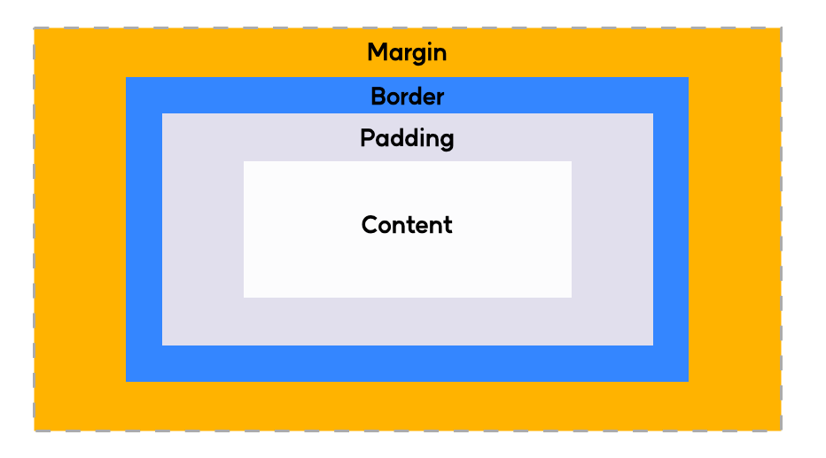
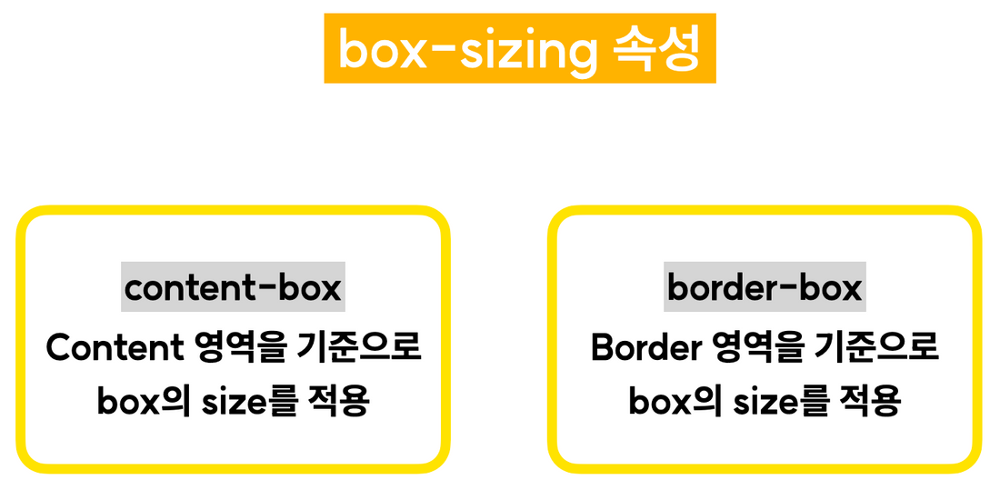
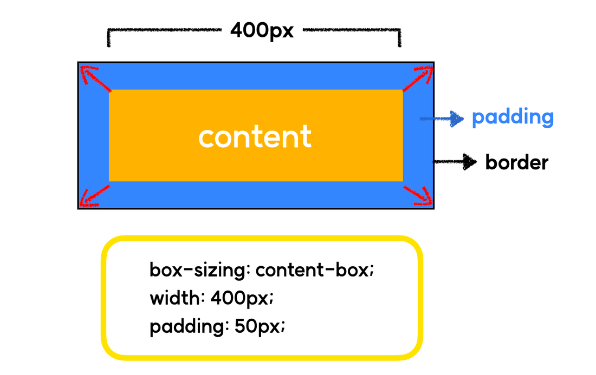
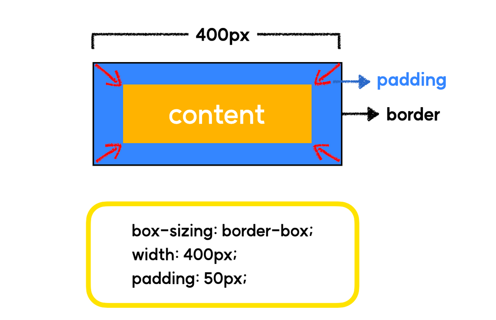

# 박스 모델
```
모든 HTML 요소는  박스(box)모양으로 구성되어있습니다.
우리는 이것을 박스모델(box-model)이라고 부릅니다.

박스모델은 HTML 요소를 패딩(padding) , 테두리(border) , 마진(margin) 그리고 내용(content) 으로 구분합니다.
```


- **`content` : 요소의 실제 내용이 차지하는 영역**
- **`padding` : 내용과 테두리 사이의 간격, 내부 여백에 해당합니다.**
- **`border` : 내용과 패딩을 감싸는 테두리**
- **`margin` : 테두리와 이웃하는 요소 사이의 간격, 외부 여백에 해당합니다.**
- **`box-sizing` : 요소의 너비와 높이를 계산하는 방법을 지정합니다.**

# box-sizing

box-sizing 속성에는 크게 두가지 속성 값이 존재합니다.


- content-box : Content 영역을 기준으로 box의 size를 적용합니다. (기본값)


- border-box : Border 영역을 기준으로 box의 size를 적용합니다. **


