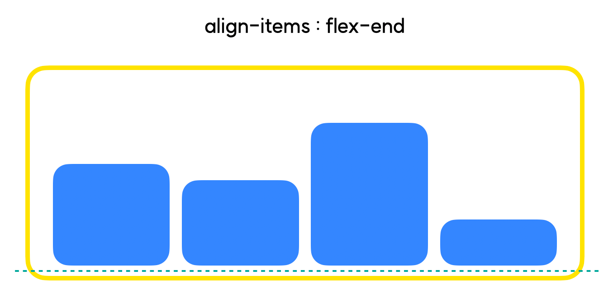

# flex 레이아웃

**flex는 레이아웃 배치 전용 기능**으로 고안되었기 때문에 float에 비해 **훨씬 편리**합니다.
그렇기 때문에 flex가 등장한 이후부터 레이아웃에 있어서 float는 찬밥신세가 되었다고 볼 수 있습니다.

자, 이제 flex를 사용해볼까요?

Flex 레이아웃을 만들기 위한 기본적인 HTML 구조는 다음과 같습니다.

```
<div class="container">
	<div class="item">박스1</div>
	<div class="item">박스2</div>
	<div class="item">박스3</div>
</div>
```
위의 코드에서 부모요소는 **container**, 자식요소는 **item** 입니다.

우리는 이제부터 부모요소를 **`Flex Container`** , 자식요소를 **`Flex item`** 이라고 부르겠습니다.

컨테이너는 Flex의 영향을 받는 전체 공간이고, 이 공간 내에 아이템들이 배치된다고 보시면 됩니다.

## flex의 속성

flex가 적용된 요소(Flexbile box)에는 `중심축(main-axis)`와 `교차축(cross-axis)`이 생깁니다.

이 중심축과 교차축은 Flexible box의 정렬 기준이 됩니다.


### 컨테이너에 적용하는 속성들

- **display : flex**
- **flex-direction (배치 방향 설정)**
    - **`row`** (행) : 중심축을 가로 방향으로 배치합니다.
    - **`column`** (열) : 중심축을 세로 방향으로 배치합니다.
- **justify-content (메인축 방향 정렬)**
    - 메인축은 flex-direction방향과 동일합니다.
    - 메인축 방향으로 어떻게 정렬할지 결정합니다.

- flex-start


- flex-end


- center


- space-between


- space-around


- space-evenly


- **align-items (교차축 방향 정렬)**
    - 교차축 방향, 즉 메인축의 수직 방향으로 어떻게 정렬할지 결정합니다.


- stretch


- flex-start 


- flex-end


- center

