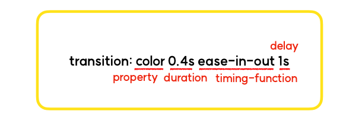

# transition

css에서 애니메이션을 줄 수 있는 방법에는 크게 두가지가 있는데요, 그 둘 중 한 방법이 바로 트랜지션 입니다.
트랜지션 은 css 속성을 이용한 변화의 전, 후 사이에 애니메이션을 추가해서 움직임을 부드럽게 만들어 줄 수 있습니다

## transition 사용해보기

### transition-property

어떤 **`속성(property)에 transition을 적용할 것 인지`** 를 지정합니다
```
transition-property: color,trasform
```
위의 코드는 color, transform 처럼 특정 프로퍼티를 지정해준 것 입니다.

 ###  transition-duration

 transition에 걸리는 시간 을 지정합니다.
 ```
 transition-duration: 0.2s
 ```

 ### transition-timing-function

 transition의 속도 패턴 을 지정합니다.
transition의 변화가 일정한 속도로 일어날 것 인지, 아니면 빠르게 시작했다가 느리게 끝날 것 인지 같은 속도 패턴을 지정합니다.
```
transition-duration: ease-in-out | linear | ease | ease-in | ease-out
```

- **`ease-in-out`** : 천천히 시작했다가, 정상 속도가 됐다가, 빠르게 끝난다.
- **`linear`** : 일정한 속도로 변화한다다.
- **`ease`** : 시작할때는 빨라지다 느려진다다.
- **`ease-in`** : 천천히 시작했다가 속도를 높여 끝난다.
- **`ease-out`** : 빠른 속도로 시작했다가, 천천히 끝난다.

### transition-delay

**`transition 요청을 받은 후 실제로 실행되기까지 기다려야 하는 시간의 양`** 을 지정합니다.
```
transition-delay: 2s
```
위의 코드는 전환효과(transition)가 시작되기까지 걸리는 시간을 지정합니다.
즉, 이벤트가 발생한 시점으로부터 2초 이후에 트랜지션이 일어나게 됩니다.
delay는 초(s), 혹은 밀리초(ms) 단위로 지정이 가능합니다.


