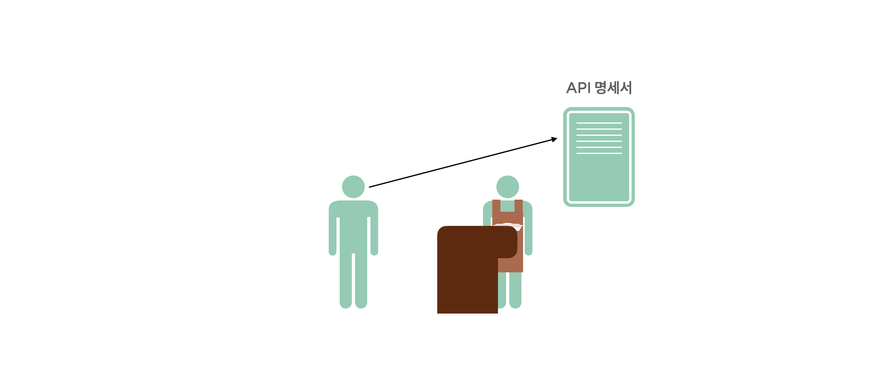

## API

API란, 어떠한 프로그램에서 제공하는 기능을 사용자가 활용할 수 있도록 만들어 둔 인터페이스입니다.

위 개념을 일상 생활과 연결지어 API가 무엇인지 간단하게 이해해 보도록 하죠.

우리가 접근하는 사이트 혹은 프로그램을 어떠한 식당이라고 가정해 보겠습니다.

그리고 그 식당에서 팔고 있는 메뉴들을 보여주는 메뉴판, 이것을 우리는 API 명세서라고 부릅니다.우리가 사용할 수 있는 기능들이 무엇이 있는지, 혹은 어떻게 사용하는 것인지가 적혀져 있죠.

그리고 그 메뉴를 주문하는 행위, 해당 사이트, 프로그램에게 어떠한 기능을 사용하겠다 라고 전달하는 행위를요청(Request)라고 합니다. 이때 요청을 전달하는 사람을 클라이언트(Client)라고 부르죠.

이때, 그 주문, 요청을 받아서 실제로 음식을 조리해주는 요리사에게 주문을 전달해주는 직원과 같은 역할요청을 받아 데이터를 가공해주는 서버에게 어떤 요청이 들어왔는지를 전달해주는 것이 바로 API입니다.

그리고 우리가 돌려 받게 되는 음식, 데이터를 응답(Response)이라고 하죠.