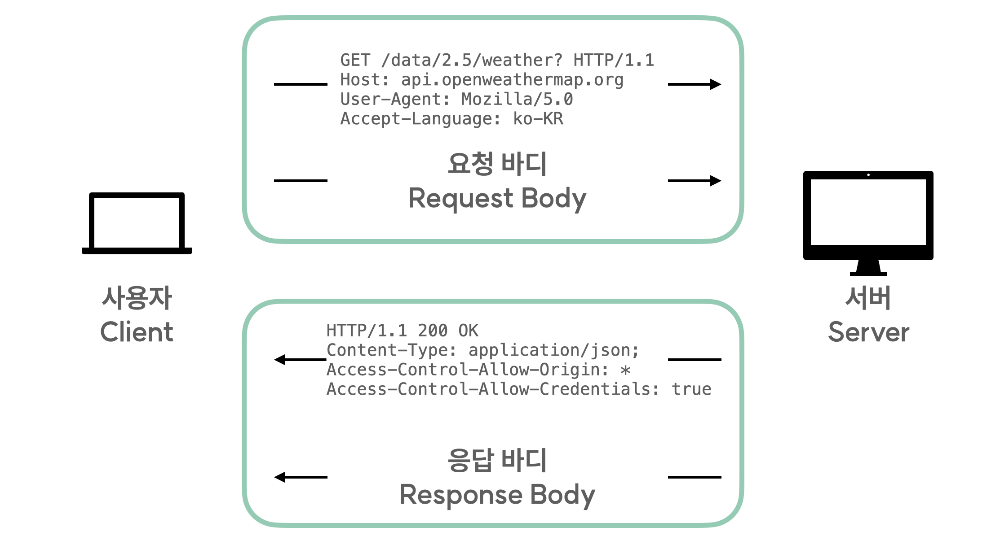

# HTTP 프로토콜

## HTTP(Hyper Text Transfer Protocol)

API와 같이 다른 서버와 통신을 할 때는 특정한 규칙에 맞춰 그 통신이 이루어져야 합니다.
현재 웹에서 통신을 진행할 때 가장 흔하게 사용되는 HTTP에 대해서 알아보겠습니다.
HTTP는  Hyper Text Transfer Protocol의 약자입니다.
간단하게 이야기해서 서로 다른 서버 간에 문자 형식으로 데이터를 주고 받을 때 지켜야 하는 규약이죠.
우리가 HTTP 통신을 할때는 몇가지의 단계를 거치게 됩니다.
우리는 그 안에서 통신을 통해 API를 사용하고 데이터를 활용하기 위해 필요한 개념, 요청과 응답에 대해서 중점적으로 알아보겠습니다. 위의 API 설명에서 요청이 무엇인지 간단하게 알 수 있었죠.
HTTP에서 요청을 보낼 때는 대상 서버로 HTTP 메세지를 보내고 요청 헤더(Request header)와 요청 바디(Request body)가 그 안에 담겨집니다.



위 이미지를 통해 요청을 보내고 응답을 받을 때의 HTTP 메세지를 확인할 수 있는데요.
먼저 Request message를 살펴볼까요?
가장 윗줄의 `GET /data/2.5/weather? HTTP/1.1`에 해당하는 부분은 start-line이라 부릅니다.
우리가 사용한 HTTP Method, 요청 URI, HTTP의 버전을 담고 있죠.
그리고 그 아래의 Host부터가 요청 헤더에 속합니다.
Request header에는 다양한 정보가 담기게 되는데, 요청을 받는 서버의 이름, 서버의 버전, 전달하는 컨텐츠의 타입, 요청 날짜, 요청을 보낸 컴퓨터의 정보 등 수많은 내용이 담겨집니다.
그리고 Request header의 내용이 모두 종료되면 하나의 빈 줄로 Request body와 구분을 해줍니다.
Request body에는 우리가 서버로 혹은 다른 사용자가 우리의 서버로 전달하고자 하는 컨텐츠를 담게 됩니다.
이때, 어떠한 메서드를 통한 요청인지에 따라  Request body를 담을 수 있는지, 없는지가 결정됩니다.

Response message도 살펴 봅시다.
`HTTP/1.1 200 OK`에 해당하는 부분은 status-line이라고 부릅니다.
HTTP 버전과 상태 코드(Status code), 응답 메세지를 담고 있죠.
그리고 두번째 줄부터가 Response header에 속합니다.
Response header도 Request header와 마찬가지로 응답 날짜, 응답을 전달한 서버의 이름, 서버의 버전, 컨텐츠의 타입 등을 담고 있습니다.
Response header 이후에 나타나는  빈 줄을 하나 거치고 나면 Response body가 나타납니다.
Response body에는 실제로 응답 리소스 데이터가 담겨져 있습니다.

> ❗️HTTP Request Method
HTTP 요청은 각 요청마다 Method를 사용하며 그 역할이 모두 다릅니다.
> 
> - GET : 서버의 데이터를 조회하는 Method ( HTTP message에 요청 바디를 담아줄 수 없다. )
> - POST : 서버에 데이터를 등록하는 Method
> - PUT : 서버의 리소스를 Request body에 담긴 내용으로 수정하는 Method
> - PATCH : 서버 내 리소스의 일부를 수정하는 Method
> - DELETE : 서버 내 리소스를 삭제하는 Method
> - OPTION : 서버에서 허용하는 Method의 목록을 알려주는 Method

```
상태 코드 ( Status code )

HTTP 통신을 통해 전달하는 상태 코드는 요청에 대한 응답의 결과를 세자리의 번호로 나타내줍니다.

1XX : 요청을 정상적으로 받은 것을 응답, 계속해서 작업중임을 뜻합니다.
2XX : 클라이언트의 요청을 수신, 승낙하였고, 정상적으로 요청이 수행될 것임을 의미합니다.
3XX : Redirection과 관련한 동작이 수행 되었을 때 돌려 받는 상태 코드입니다.
4XX : 클라이언트가 보낸 요청이 잘못 되었음을 의미하는 상태 코드입니다.
5XX : 서버에서 요청을 받아 로직을 수행하는 과정에서 문제가 생겼을 때 받게 되는 상태 코드입니다.

상태 코드 목록 : [**Status code list**](<https://developer.mozilla.org/ko/docs/Web/HTTP/Status>)
```