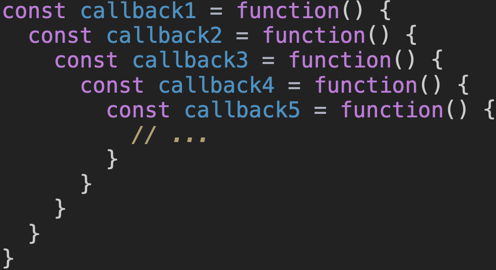
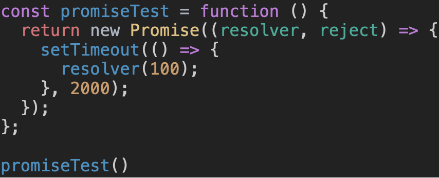

# 🌿 Promise 객체

## 비동기 처리

자바스크립트는 **`싱글 스레드`**이기 때문에 한번에 하나의 동작만 수행할 수 있습니다.
즉, **`동기적`**으로 동작하죠.

이러한 한계점을 해결, 비동기 작업을 수행하기 위해 가장 먼저 나온 해결책은 **`callback 함수`**를 활용하는 것이었습니다.

하지만 완벽한 해결책은 아니었죠.
위와 같이 callback 함수가 여러번 중첩되는 경우
가독성에서 심각한 손해를 보게 되는 **`콜백 지옥(callback hell)`**을 만나게 되는 것이 문제였습니다.

각 함수마다 정상적인 동작에 대한 처리, 에러에 대한 처리가 필요했기 때문에 그 코드의 양은 더욱 많아질 수 밖에 없었습니다.

## Promise

그래서 이러한 문제점을 해결하기 위해 **`Promise`** 의 개념이 나타났습니다.
Promise는 현재는 얻을 수 없지만, 추후 작업이 완료되면 받아올 수 있는 데이터에 대한 접근 수단의 역할을 해줍니다. 우리는 이 Promise 객체를 직접 생성해 줄 수 있어요.
**`new Promise()`**와 같은 코드를 입력하면 됩니다.
Promise 객체는 총 세가지의 상태를 갖게 됩니다.

> **대기(Pending)** : 비동기 처리가 아직 완료되지 않은 상태
**이행(Fulfilled)** : 비동기 처리가 완료되어 결과값을 반환해준 상태
**실패(Rejected)** : 비동기 처리가 실패 혹은 오류가 발생한 상태
> 

그러면 직접 Promise 객체를 살펴봅시다.

위 코드는 promiseTest라는 함수를 실행 했을 때, 그 반환 값으로 Promise 객체를 돌려받는 코드입니다.

Promise 객체를 생성할 때는 내부에 함수를 인자로 넣어줄 수 있는데, 이때 그 내부 함수는 resolver, reject를 매개변수로 받아올 수 있습니다.

비동기 처리가 완료되면(Fulfilled), resolver가 호출됩니다.
비동기 처리에 실패하면(Rejected), reject가 호출되죠.

그리고 위 함수를 보면 resolver의 실행을 2초간 지연시키고 있어요.

때문에 해당 Promise 객체를 돌려 받은 뒤, 2초가 지나기 이전에 참조하려 하면 Pending 상태임을 돌려받게 됩니다. 아직 resolver가 호출되지 않았기 때문이죠.