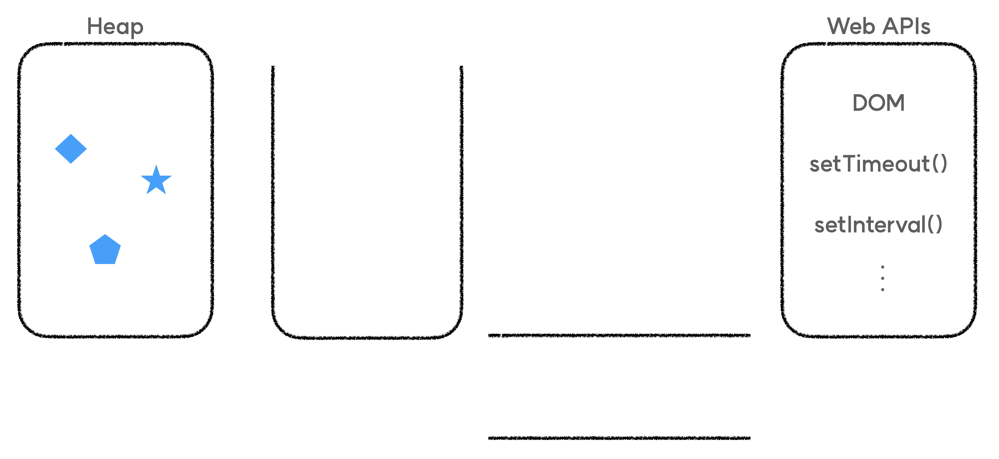
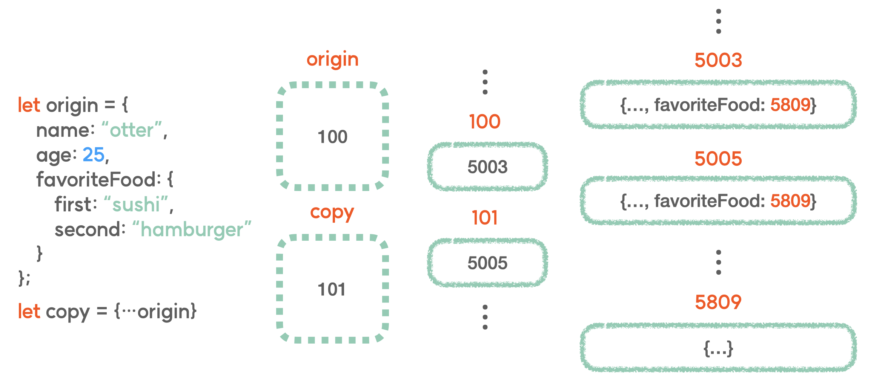

# 🌿 구조분해할당 (destructuring assignment)

구조분해할당이란, 구조화 되어 있는 배열, 객체와 같은 데이터를 분해하여 각각의 변수에 다시 할당하는 것을 이야기합니다. 배열과 객체의 값을 각각의 변수에 담아 관리하고 싶다면, 즉, 값을 복사해주고 싶다면 어떻게 할 수 있을까요?


```javascript
const arr = [ 1, 2, 3, 4, 5 ];

let one = arr[0];
let two = arr[1];

---------------------------------------------

const obj = {
	name: "otter",
	gender: "male"
}

let userName = obj.name;
let userGender = obj.gender;

```

위의 코드처럼 작성한다면, 각각의 값을 따로 담아서 관리해줄 수가 있겠죠?
하지만 위의 방법은 관리할 데이터가 여러개인 경우, 각각의 데이터를 모두 변수로 선언해 주어야 하기 때문에 굉장히 비효율적이죠. 이런 경우 우리는 구조분해할당을 사용할 수 있습니다.

## 배열 구조분해할당

배열을 구조분해할당 하는 방법부터 알아볼까요?

```
const arr = [ 1, 2, 3, 4, 5 ];

let [ one, two ] = arr; **// 배열의 구조분해할당**
```

배열을 구조분해할당 해줄 때는 위의 코드처럼 작성 해주면 됩니다. 먼저 선언 키워드를 적어준 후, 대괄호를 적어줍니다. 그리고 그 안에 변수명으로 사용하고자 하는 문자를 입력해주면 됩니다. 그 뒤에는 할당 연산자, 구조분해할당 해주고 싶은 배열을 입력해 주시면 됩니다.
이때, 변수명으로 사용하고자 하는 문자들은 쉼표(,)로 구분 해주고, 그 개수에 따라 주어진 배열의 앞에서부터 차례대로 각각의 변수에 담기게 됩니다. 배열을 한번 분해해서, one과 two라고 하는 새로운 변수에 담아주는거죠.

```javascript
const arr = [ 1, 2, 3, 4, 5 ];

let [ one, two ] = arr;

console.log(one, two);
```
이후 one과 two 변수를 참조해 보면, 배열 arr의 가장 앞의 요소부터 차례대로 숫자 1과 2가 담겨져 있는 것을 확인할 수 있습니다.

## 객체 구조분해할당

객체를 구조분해할당 하는 방법은 조금 다릅니다.
```javascript
const obj = {
	name: "otter",
	gender: "male"
}

let { name, gender } = obj
```
위의 코드처럼 작성해주면 객체 obj의 구조분해할당이 완료됩니다.
배열과 같이 선언 키워드를 먼저 적어주고, 객체는 대괄호가 아닌 중괄호를 입력해서 구조분해할당을 수행합니다.

```javascript
let {}
```
이때, 배열과 같이 중괄호 안에 담기는 명칭들이 변수명이 되는데요.
객체의 경우 실제로 obj 객체 안에 존재하고 있는 property의 key를 적어 주어야
```javascript
let { name, gender }
```
그에 대응하는 value들을 해당 변수에 담아주게 됩니다.
그리고 뒤에는 할당 연산자를 적어주신 후에 구조분해할당 해주고자 하는 객체를 적어주시면 되겠죠.

```javascript
let { name: a, gender: b } = obj
```
이렇게 해주면 각 key에 대응하는 value들이 a와 b라는 변수에 담기게 됩니다.

# 🌿 Spread 연산자

## 값의 복사

구조분해할당을 사용하면 배열과 객체의 요소들을 하나하나 손쉽게 복사해줄 수 있었습니다.
그런데 만약 배열 자체를 복사하고 싶다면 어떻게 해야할까요?

```js
const arr = [ 1, 2, 3, 4, 5 ];
const newArr = arr
```
전개해주고 싶은 배열의 앞에 마침표를 세개 적어주시면 됩니다.
위와 같이 입력해주면 해당 배열의 대괄호가 한꺼풀 벗겨지게 되는거죠.

# 🌿 깊은 복사, 얕은 복사

## 얕은 복사 (shallow copy)

스프레드 연산자를 사용하면 값의 복사를 수행할 수도 있습니다.

```javascript
const arr = [ 1, 2, 3, 4, 5 ];
const newArr = [ ...arr ];
```

위 코드는 스프레드 연산자를 사용한 값의 복사입니다.
arr이라는 배열을 스프레드 연산자를 사용해서 펼쳐준 뒤에 다시 새로운 대괄호 안에 담아준거죠.
이렇게 해주면 기존에 arr 배열이 가지고 있던 주소값과 전혀 별개의 새로운 배열이 newArr이라는 변수에 담기게 됩니다. 참조 타입의 값의 복사를 성공한거죠!

배열 뿐만 아니라 객체도 스프레드 연산자를 사용한다면 복사가 가능합니다.

```javascript
const obj = {
	name: "otter",
	gender: "male"
}

const newObj = { ...obj }
```

배열과 똑같이 객체를 한번 펼쳐준 뒤에 새로운 중괄호로 감싸서 전혀 다른 객체를 하나 만들어준겁니다!
이렇게 해주면 원본 객체와 연결되지 않은 전혀 새로운 객체로 복사가 되는거죠.
자 그렇다면 우리는 드디어 참조 타입의 완전한 복사를 수행한걸까요?
아래의 예시를 살펴봅시다.

```js
const obj = {
	name: "otter",
	gender: "male",
  favoriteFood: {
		first: "sushi",
		second: "hamburger"
  }
}

const newObj = { ...obj }
```

위 객체는 중첩 객체입니다.
객체 안에 favoriteFood라고 하는 또 다른 객체가 존재하고 있죠.
obj 객체의 name, gender와 내부 객체 favoriteFood의 property를 변경해볼까요?
그리고 이어서 복사본인 newObj를 살펴보겠습니다.

```js
obj.name = "rabbit"
obj.gender = "female"
obj.favoriteFood.first = "cold noodle"

console.log(newObj)

/*
	{
		name: "otter",
		gender: "male",
	  favoriteFood: {
			first: "cold noodle",
			second: "hamburger"
	  }
	}
*/
```

이상하네요. name과 gender는 영향을 받지 않았는데, 내부 객체 favoriteFood는 여전히 영향을 받고 있습니다.
우린 분명 스프레드 연산자로 복사가 완료된 것을 확인했는데, 중첩 객체는 제대로 복사가 되지 않은 것 같네요.
이는 우리가 스프레드 연산자를 사용해서 해준 복사가 얕은 복사이기 때문입니다.

## 깊은 복사 (deep copy)

자바스크립트의 실행 환경은 call stack, callback queue 외에도 다양한 영역이 있는데, 그 중에서 heap이라는 영역에 대해 알아보고자 합니다.




우리가 아는 참조 타입의 데이터는 heap이라는 임시 저장 메모리에 담기게 됩니다.


그리고 이 heap이라는 영역은 참조 타입 데이터와 같이 그 데이터의 크기가 유동적으로 변할 수 있다는 특징을 가지고 있습니다.


그리고 우리가 중첩 객체를 스프레드 연산자로 복사했을 때의 문제점도 이 개념에서 찾아볼 수 있죠.

스프레드 연산자를 사용해서 객체의 중괄호를 한번 벗겨냈을 때, 다른 property들은 모두 주소값의 연결이 끊어진채로 새로운 주소를 가진 데이터로 완전히 복사가 되었지만, 이때도 그 내부에 존재하는 favoriteFood 객체는 펼쳐지지 못한거죠.

그래서 원본 객체의 favoriteFood와 복사된 객체의 favoriteFood는 여전히 같은 주소값을 공유하고 있었던겁니다. 우리는 이러한 문제를 해결하기위해서 JSON.stringify()와 JSON.parse()를 사용할 수 있습니다.
JSON.stringify()는 소괄호 안에 들어가는 값을 JSON 데이터 포맷, 즉 문자열로 변환해줍니다.

```js
const obj = {
	name: "otter",
	gender: "male",
  favoriteFood: {
		first: "sushi",
		second: "hamburger"
  }
}

const copy = JSON.stringify(obj)

console.log(copy)
// {"name":"otter","gender":"male","favoriteFood":{"first":"sushi","second":"hamburger"}}
```
위의 예시처럼 문자열로 변환이 된다면, copy에 담긴 값은 더이상 객체가 아니며 완전히 새로운 문자열이기 때문에 전혀 새로운 주소값을 가지게 됩니다.

```js
const deepCopy = JSON.parse(copy)

console.log(deepCopy)

/*
	{
		name: "otter",
		gender: "male",
	  favoriteFood: {
			first: "sushi",
			second: "hamburger"
	  }
	}
*/
```

이후, JSON.parse()를 사용해서 JSON 데이터 포맷을 다시 객체 형태로 바꿔주면,

이때 새로운 객체가 생성되며 deepCopy에 담기는 것이기 때문에 원본 객체와는 전혀 다른 주소값을 가진 객체가 생성되는 것이죠.

이러한 복사를 깊은 복사라 부릅니다.

# 🌿 rest 파라미터

## rest parameter

rest parmeter는 함수의 매개변수(parameter)를 배열로 전달 받는 방식입니다.

```js
const foo = function(one, two, ...rest) {
	console.log(rest)
}

foo(1, 2, 3, 4, 5) // [ 3, 4, 5 ]
```

매개변수를 정의하는 과정에서 rest parameter의 개념을 적용 시키면,
함수를 호출하는 과정에서 다수의 전달인자(arguments)가 건네졌을 때 변화가 생깁니다.
one과 two 매개변수에는 주어진 전달인자의 첫번째, 두번째 데이터가 담깁니다.
rest 매개변수에는 앞선 두개의 데이터를 제외한 나머지 데이터가 배열의 형태로 담기게 됩니다.
또한 rest parameter도 매개변수임은 다르지 않기에 원하는 이름으로 사용할 수 있습니다.

```js
const foo = function(one, two, ...arr) {
	console.log(arr)
  // rest 파라미터 또한, 매개변수이기 때문에 임의의 변수명 지정 가능
}

foo(1, 2, 3, 4, 5) // [ 3, 4, 5 ]
```
그리고 들어오는 데이터를 전부 rest parameter로 받아올 수도 있죠.
```js
const foo = function(...rest) {
	console.log(rest)
}

foo(1, 2, 3, 4, 5) // [ 1, 2, 3, 4, 5 ]
```
전달인자로 몇개의 데이터가 들어오든 우리는 rest란 이름의 배열로 모두 받아올 수 있게 됩니다.

❗️ rest parameter 주의사항

```js
rest parameter를 작성할 때는 반드시 마지막에 위치해야 합니다.

잘못된 예시

const foo = function(one, ...rest, two) {
   console.log(rest)
}
```