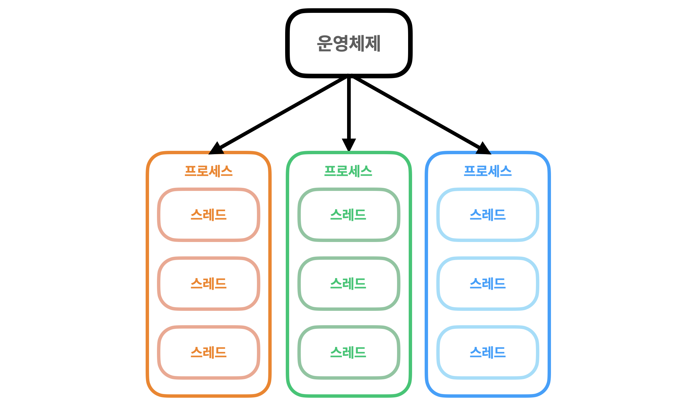
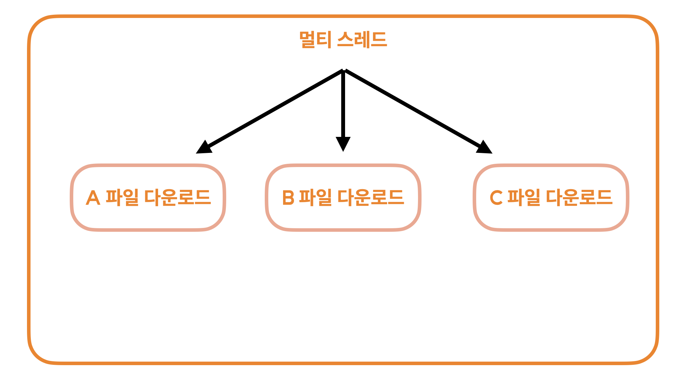
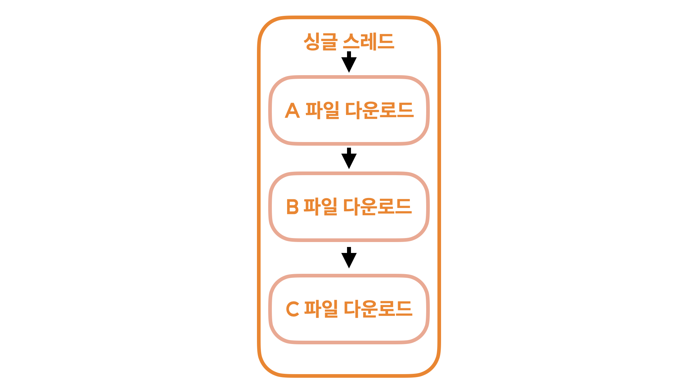
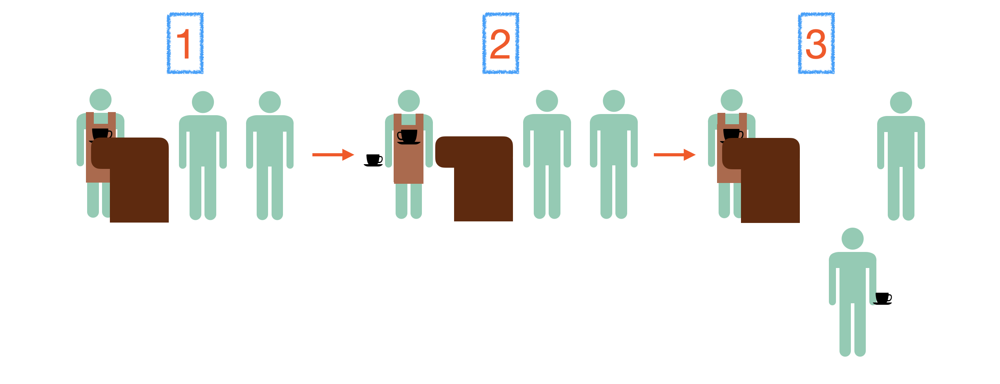
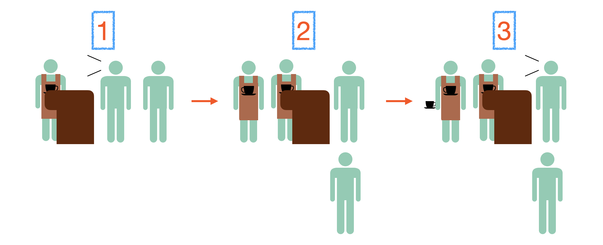
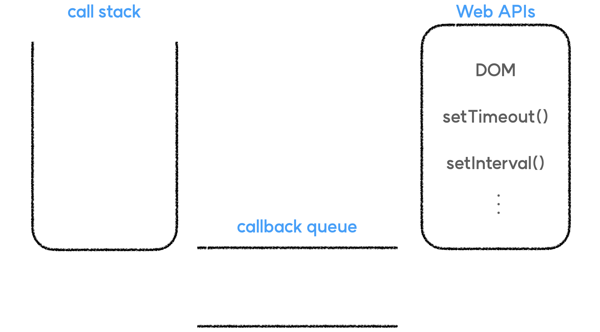
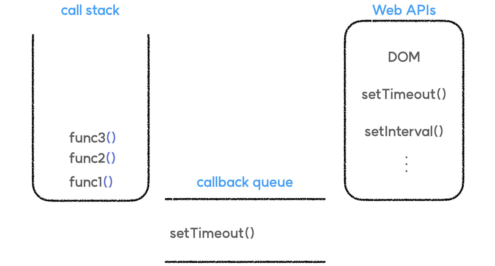
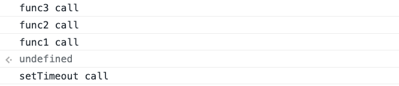

# 동기와 비동기

우리의 운영체제에게 프로세스라고 하는 작업 영역을 할당 받아 어떠한 동작을 수행합니다.
코드의 실행, 프로그램의 실행, 파일 다운로드 등이 모두 프로세스별로 할당이 되죠.




그리고 각 프로세스 내부에는 할당 받은 업무를 처리할 스레드가 존재합니다.
스레드가 여러개라면, 하나의 프로세스 내에서 여러개의 작업을 동시에 수행할 수가 있겠죠.



스레드가 여러개 있는 작업 환경을 멀티 스레드라고 합니다.
다양한 작업을 동시간 대에 시작할 수 있죠.



그리고 스레드가 각 프로세스별로 하나씩만 존재하는 경우가 있습니다. 이런 환경을 싱글 스레드라고 하죠.
그리고 우리가 배우는 JavaScript는 싱글 스레드 기반의 언어입니다.
때문에 JavaScript는 동기적으로 동작합니다.

## 동기, 비동기

동기와 비동기에 대해서 알아볼까요.

동기란, 하나의 작업이 종료될 때까지 다음 동작은 기다리는 실행 방식을 의미합니다.




```

1. 손님이 주문합니다.
2. 앞선 손님의 주문에 대한 응답이 완료될 때까지 다음 손님은 아무런 동작을 할 수 없습니다.
3. 앞선 손님이 주문에 대한 응답을 받았다면 다음 손님이 주문할 수 있습니다.
```
동기는 위의 예시처럼 동작합니다.

그렇다면 비동기는 어떨까요.


```
1. 손님이 주문합니다.
2. 앞선 손님의 주문이 완료되는 동안 해당 손님은 옆 대기줄에서 본인의 주문이 완료될 때까지 기다립니다.
3. 그와 동시에 다음 손님의 주문도 이뤄집니다.
```
비동기는 위의 예시처럼, 하나의 작업이 진행됨과 동시에 또 다른 작업도 함께 진행되는 것을 이야기합니다.
JavaScript는 한번에 하나의 기능만을 수행하는 싱글 스레드이기 때문에 동기적으로 동작하죠.
그렇다면 아래의 코드는 어떻게 동작할까요?

```javascript
console.log("1")

setTimeout(() => {
    console.log("2")
}, 2000)

console.log("3")
```
해당 코드를 실행해 보면, 1과 3이 먼저 출력되고 2초 후에 2가 출력됩니다.
이상하죠? 분명 자바스크립트는 싱글 스레드이기 때문에 한번에 하나의 작업만 가능할텐데
어떻게 setTimeout 함수의 실행을 건너뛰어서 3이 먼저 출력될 수 있었을까요?
이에 대해 알기 위해서는 JavaScript의 실행 환경을 살펴봐야 합니다.


JavaScript의 실행 환경 내부에는 call stack과 callback queue라고 하는 영역이 존재합니다.
해당 영역은 각각 자료구조 stack과 queue의 형태를 띄고 있죠.

> stack : LIFO(Last In First Out)으로 내부 데이터가 처리됩니다. 먼저 들어온 함수, 데이터가 가장 마지막에 처리되는 구조입니다.
queue : FIFO(First In First Out)으로 내부 데이터가 처리됩니다. 먼저 들어온 함수, 데이터가 가장 먼저 처리되는 구조입니다.
> 

먼저 기본적인 함수들은 모두 call stack에 쌓이게 됩니다.
그리고 비동기 함수(Web APIs 포함)들은 모두 callback queue에 쌓이게 되죠.
call stack에 쌓인 기본 함수들은 먼저 담긴 함수들이 위에 쌓인 함수들의 종료를 기다리게 됩니다.
callback queue에 쌓인 비동기 함수들은 call stack이 비워져 있다면, 그 때 call stack으로 하나씩 옮겨집니다.

```javascript
setTimeout(() => {
	console.log("setTimeout call")
})

const func3 = function() {
	console.log("func3 call")
}

const func2 = function() {
	func3()
	console.log("func2 call")
}

const func1 = function() {
	func2()
	console.log("func1 call")
}

func1()
```
예를 들어, 위와 같은 코드를 실행하면, setTimeout 함수는 지연 시간을 지정해주지 않았음에도 불구하고 callback queue 영역으로 옮겨집니다. 비동기 함수이기 때문이죠.
그래서 아래와 같이 함수가 담기게 됩니다.



call stack 영역에 쌓인 함수는 LIFO 방식으로 수행되기 때문에 func3, func2, func1 순서로 함수가 완수될 것입니다. 그리고 해당 함수들이 모두 완료되면 그 후에 callback queue에 담긴 setTimeout 함수가 call stack으로 옮겨져 실행되며 마지막으로 "setTimeout call" 메세지가 출력될겁니다.

