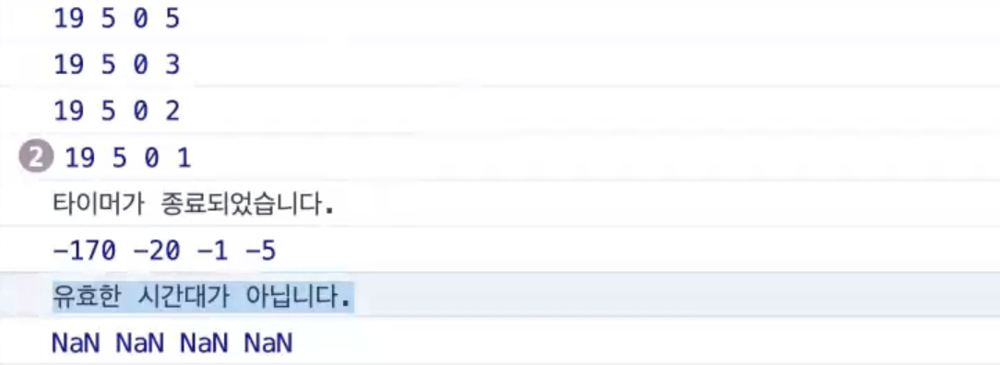

## 조건문

우리는 코딩을 하면서 한번쯤 ‘아.. 이때만 실행됐으면 좋겠다..’라는 생각을 했던적이 한번쯤은 있을 것 입니다.
이런 아쉬움을 바로 조건문이 해소해 줄 수 있습니다.
**`조건문`** 은 **`우리가 작성한 조건이 참일경우 지정한 코드를 수행하도록 하는 기능`** 입니다.
조건문 역시 여러 종류의 조건문이 있지만, 우리는 그 중 가장 유명한 **`if문`** 을 배워보도록 하겠습니다.

## if…else

**`if`** 문은 특정 조건이 **`참일때 명령문을 실행`** 하며, **`거짓일경우`** 에는 **`else 문을 실행`** 하게 됩니다.
또한 **조건은 비교연산자를 사용 한 참 또는 거짓으로 평가되는 표현식**입니다.

```
if( 조건1 ) {
	// 조건1이 참이면 실행
} else if( 조건2 ) {
	// 조건1은 거짓, 조건2는 참이면 실행
} else {
	// 모두 거짓이면 실행
}
```
```
else if 문은 중첩될 수 있습니다.
즉, 여러개의 else if 가 있어도 무방합니다.

if(user.name==="peter"){
	console.log("안녕하세요. peter님")
}else if(user.name==="jason"){
	console.log("안녕하세요. jason님")
}else{
	console.log("저희 멤버가 아니신가요?")
}
```
### 조건문 예시

```
if(user.name==="peter"){
	console.log("안녕하세요. peter님")
}else if(user.name==="jason"){
	console.log("안녕하세요. jason님")
}else{
	console.log("저희 멤버가 아니신가요?")
}
```

### 레벨업!

> 논리 연산자
**`&& (and 연산자)`** : 양쪽에 위치한 조건을 모두 만족한 경우 true
**`|| (or 연산자)`** : 양쪽 중 하나라도 만족한 경우 true
**`! (not 연산자)`** : boolean의 값을 반전 시켜주는 논리 연산자. (true값이었던건 false로, false값이었던건 true로.)**
>

### 레벨업!

> **falsy값 ⇒ 거짓과 같은것으로 치는 값!**
> 
> - undefined
> - null
> - 0
> - ””
> - NaN
> 이외의 데이터는 truthy한 값 입니다.

# 🌿 조건에 따른 메세지 출력

- 정상적인 시간이 입력된 경우
- 타이머가 만료, 혹은 이미 지난 시간대가 입력된 경우
- 잘못된 날짜 형식이 입력된 경우

위 세가지 경우에 따라 상황에 맞는 메세지가 아래의 콘솔창과 같이 출력되어야 합니다.

