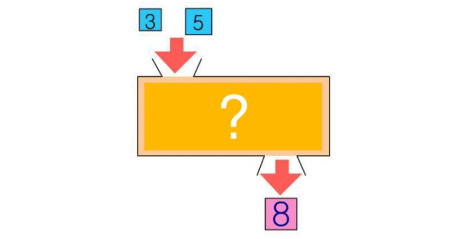

# 함수


**`함수`** 는 **`우리가 만드는 기능`** 입니다.

지금까지는 메서드 같은 **`자바스크립트에서 제공되는 기능`** 들을 사용했지만, 이제부터는 우리가 **직접 기능을 만들어 사용해보도록** 하겠습니다.

함수를 만들려면?

예를들어, 두 숫자를 더하는 함수(기능)을 만들어 봅시다.

1. 아래의 그림에서 **`네모박스`** 가 **`함수(기능)`** 입니다
2. 상자로 들어가는 데이터 **`3, 5`** 는 **`입력데이터(매개변수= parameter)`** 라고 합니다.
3. 상자에서 반환되어 나오는 **`8`** 은 **`결과데이터(반환데이터= return 값)`** 라고 합니다.




## 함수의 선언식
```javascript
function 함수이름(param1, param2, ...){
    // ...code here
    return 결과값
}
```
## 함수의 표현식
```javascript
const 함수이름 = function**(param1, param2, ...){
    // ...code here
    return 결과값
}
```
변수에 할당된 함수는 함수 선언식과 어딘가 비슷하게 생기지 않았나요?

비슷하게 보이지만, 어딘가 달라보이는 저 함수는 **익명함수**라고 부릅니다.

나중에 호이스팅을 공부하시게 된다면 알게되실텐데, 함수선언식의 기명함수는 호이스팅의 영향을 받는 반면에 **함수 표현식의 익명함수는 호이스팅의 영향을 받지 않습니다.**

따라서 여러분들은 앞으로 선언식보다는 표현식 사용을 권장 드립니다.

##  ✅ 화살표 함수 : 실무함수
```
const 함수이름 = ( param1, param2, ... )=>{
    // ...code here
    return 결과값
}
```

❗️ 매개변수(parameter)와 return 값은 필수가 아닙니다.
→ 매개변수와 리턴값은 있어도 되고 없어도 되는 값이기 때문에 반드시 적어주실 필요는 없습니다.
상황에 따라 필요하실 때 적절히 적어주시면 됩니다.

## 기능 예제
```javascript
// 로그인검증기능 만들기
function validation(email, password){
  if(!email.includes("@")) {
  alert("이메일 주소를 다시 확인해주세요.")
  return false
} else if(8<=password.length && password.length<=16){
  alert("8~16자의 영문, 숫자, 특수문자만 사용 가능합니다.")
  return false
} else {
  return true
 }
}

// 로그인검증기능 사용하기
const email = "email&naver.com"     // 사용자가 입력창에 입력한 이메일을 변수에 담기
const password = "1234"             // 사용자가 입력창에 입력한 비밀번호를 변수에 담기
validation(email, password)         // false

```

