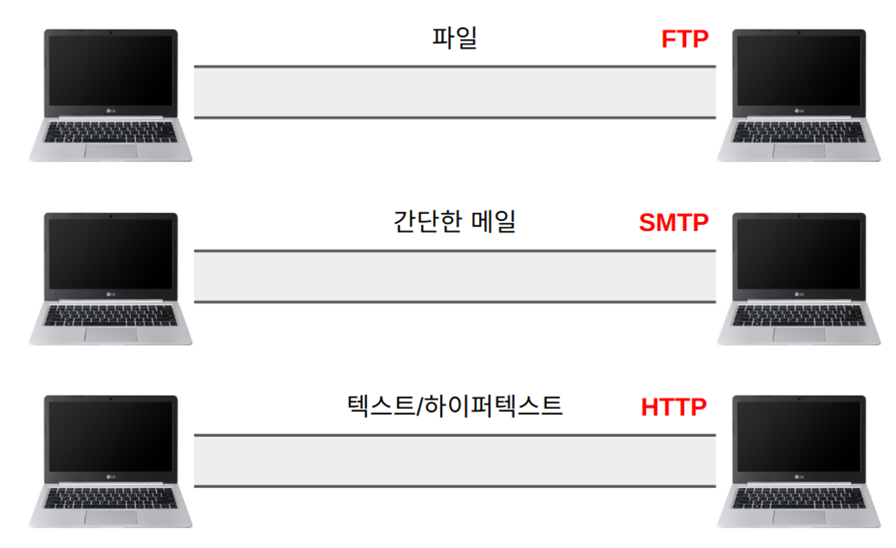
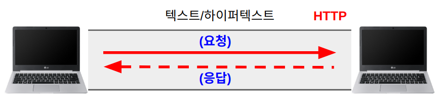
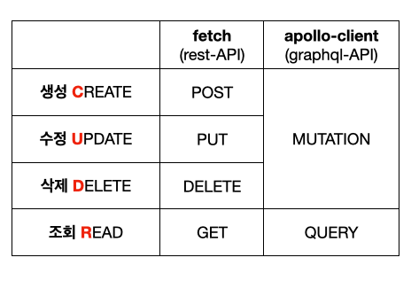
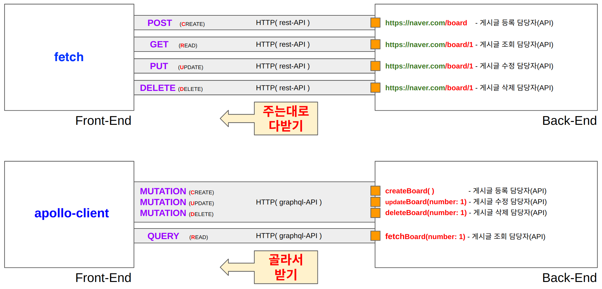

# HTTP 통신

**`HTTP`**란 **`두 컴퓨터간에 텍스트 데이터를 주고 받는 길`**입니다.

HTTP 라는 길로  요청(request)과 응답(response) 2가지를 서로 주고 받을 수 있습니다.

# HTTP 요청(Request)과 응답(Response)

### HTTP 요청(Request)

웹브라우저에서 홈페이지(Front-end)가 실행중이라면, 작성한 게시물 **`텍스트 데이터`**를 HTTP를 통해 **`Back-end 컴퓨터로 보내고`** Back-end 컴퓨터에게 이 데이터를 데이터베이스에 저장 해달라고 **`요청`**합니다.

### HTTP 응답(Response)

요청을 받은 Back-end 컴퓨터가 성공, 실패 등 처리 결과를 **`응답`**합니다.

> ❗️ **하나만 더!**
Back-end 컴퓨터는 응답할 때, **`응답 상태코드`** 라는 것도 함께 보내줍니다.
**`응답 상태코드`**는 100~ 599까지의 숫자로 구성되어 있습니다.
자주 볼 수 있는 응답 상태코드는 **`성공(200)`**, **`Front-end 에러(400), Back-end 에러(500)`** 등이 있습니다.
예를들면, 요청에 성공하였으면 성공 메시지와  **`응답 상태코드 200`**을 함께 보내줍니다.
> 
> 
> **`더 많은 상태코드(MDN): https://developer.mozilla.org/ko/docs/Web/HTTP/Status`**
> 

> ❗️ ***데이터베이스에 바로 요청하면 안되나요?***
보안 및 데이터 정제 등의 이유로 **`Back-end에서 검증 과정을 거쳐야 하기 때문`**에, 아무나 함부로 데이터베이스에 요청할 수 없습니다.
>

# API

**`API란 HTTP 요청을 Back-end 컴퓨터에 보냈을때 실행되는 Back-end 기능입니다.`**

Front-end에서 HTTP라는 길을 통해서 게시물 데이터를 Back-end에 보내 저장시켰습니다.

만약, 게시물이 아닌 프로필 데이터를 저장하고 싶으면 어떻게 해야 할까요?

그러기 위해선, **`여러개의 HTTP 라는 길이 존재`**해야 하고, 각각의 요청마다 담당자가 필요합니다.

우리는 이 담당자를 **`API`** 라고 부릅니다.

❗️API가 기능 이라고 했는데, 기능은 함수 아닌가요?
정확합니다! Back-end 개발자가 만든 함수입니다. 함수는 인자와 return 데이터가 있었죠?!
API에 요청할 때 보내는 데이터는 API 함수로 들어갈 인자이고, 응답으로 받게되는 데이터가 API 함수의 return 데이터 입니다.

# API 종류(rest-API vs graphql-API)

API의 종류는 크게 **`rest-API`**, **`graphql-API`** 로 2가지가 있습니다.

rest-API 와 graphql-API 는 몇가지 차이점이 있습니다.

## rest-API와 graphql의 차이점

### 1. 함수 이름의 차이

rest-API는 **`API 이름이 마치 홈페이지 주소`**처럼 생겼습니다.

graphql-API는 **`API 이름이 일반적인 함수`**와 같습니다.

### 2. 응답 결과물의 차이

**`rest-API`** 는 응답 결과로 back-end 개발자가 만든 함수에서 보내주는 **`모든 데이터`**를 받아야만 합니다.

반면에, **`graphql-API`**는 back-end 개발자가 만든 함수에서 **`필요한 데이터만`** 골라 받을 수 있습니다.

****이러한 이유로, 각 API에 전송을 요청하는 담당자도 다릅니다.

**`rest-API`** 에 요청하는 요청담당자는 **`fetch`** 입니다.

**`graphql-API`** 에 요청하는 요청담당자는 **`apollo-client`** 입니다.

요청담당자는 Front-end 에서 설치하는 라이브러리입니다.

graphql은 필요한 데이터만 골라 받을 수 있는 장점이 있어서, 효율적인 통신을 할 수 있습니다.

**`graphql은 페이스북에서 발생하는 수많은 데이터를 처리하기 위해 페이스북 개발팀에서 만들었으며,`**

**`facebook, airbnb, github 등 유명한 사이트에서 사용중인 통신 방법입니다.`**

우리도 역시, graphql을 기준으로 수업을 진행합니다.

> ❗️ **그러면, rest-API는 배우지 않아도 되나요?**
우리는 더 효율적인 방식의 graphql을 위주로 수업을 진행합니다.

그럼에도 불구하고, **`rest를 배워야하는 이유 2가지`**가 있습니다.
1. 웹 개발은 혼자 하는 것이 아닙니다. 내가 취업한 **`회사/팀에서 rest를 사용`**중일 수 있습니다.
2. **`다른 회사에서 제공해주는 API를 사용`**하는 경우도 있습니다. 예를들면, 카카오로 로그인하기 기
    능은, 카카오에서 제공해주는 API를 사용해야하는데, 이러한 기능들은 대부분 rest-API로 제공
    되고 있습니다.
>

## 설치해야 할 프로그램의 차이  
REST API와 GraphQL API를 사용하기 위해서는 각각 필요한 프로그램을 설치해야 합니다.

### 설치해야 하는 프로그램 비교  
| API 종류      | 설치해야 하는 프로그램 |
|--------------|------------------|
| REST API     | fetch (기본 제공) |
| GraphQL API | apollo-client    |

# API 응답 데이터 JSON ( JavaScript Object Notation )

**JSON은 자바스크립트의 객체 표기법입니다.** 

객체도 아닌 객체 표기법은 무엇일까요?

## JSON이란?

**백엔드에서 응답을 받을 때, 객체 자체를 주고 받을 수 없습니다.**

따라서 객체를 문자열로 묶어서 객체를 담은 문자열을 보내게 되는데, **객체를 담은 문자열을 객체 표기법** 이라고 합니다.

즉, **백엔드에서 응답의 결과물로 넘겨주는 것이 JSON이고, JSON은 객체를 담은 문자열** 정도로 생각하시면됩니다.

받아온 **JSON 데이터는 프론트에서 문자열을 벗겨 객체로 사용**하게 됩니다.

## JSON의 특징과 응답헤더

응답으로 주고받은 **JSON은 응답의 body 부분**입니다.

응답에는 header와 body부분으로 나뉘는데 body에는 JSON이 들어간다고 말씀 드렸습니다.

그렇다면 header에는 어떤게 들어갈까요?

**header**에는 **body와 관련된 요약정보**가 들어가게 됩니다.

요약정보라 함은 응답을 보내는 사이트가 어디인지, 바디의 형태는 JSON인지 등등을 포함하고 있습니다.

API는 크게 4가지 방식으로 구분할 수 있습니다.

1. 새로운 것을 **`생성하는 API`**    ⇒   **C**REATE
2. 기존의 것을 **`조회하는 API`**    ⇒   **R**EAD
3. 기존의 것을 **`수정하는 API`**    ⇒   **U**PDATE
4. 기존의 것을 **`삭제하는 API`**    ⇒   **D**ELETE

# API 명세서

**`API 명세서`**는 **`API 사용 설명서`**입니다.

홈페이지를 만들기 전, Back-end 개발자가 만들어 놓은 API 가 몇 개 있고, 어떻게 구성되어있는지 확인하기 위해 필요합니다.

**`API명세서는 Back-end 개발자에게 받아야 합니다.`** Back-end 개발자는 자신이 만든 API를 직접 문서 형태로 작성하거나, **swagger** 라는 프로그램을 설치해서 만듭니다.

## API Endpoint, Method

### API Endpoint란?

**API Endpoint**는 클라이언트가 서버에 데이터를 요청하거나 명령을 수행하기 위해 접근하는 URL을 의미합니다. 서버에서 클라이언트가 데이터를 조회, 저장, 수정, 삭제할 수 있도록 인터페이스를 제공하는 지점입니다. 예를 들어, `https://api.example.com/users/1`은 사용자 정보를 가져오는 API 엔드포인트입니다.

### HTTP Method란?

API 요청은 **HTTP Method**로 구분됩니다. 이 메서드는 서버에 데이터를 어떻게 처리할지 정의하며, 주로 아래와 같은 메서드가 사용됩니다:

- **GET**: 서버에서 데이터를 가져오는 요청. 데이터를 조회할 때 사용합니다.
    - 예: `GET /users/1` (ID가 1인 사용자의 정보를 가져오기)
- **POST**: 서버에 데이터를 전송하고 새로운 데이터를 생성하는 요청.
    - 예: `POST /users` (새로운 사용자 생성)
- **PUT**: 서버에서 기존 데이터를 업데이트하는 요청.
    - 예: `PUT /users/1` (ID가 1인 사용자의 정보를 업데이트)
- **DELETE**: 서버에서 데이터를 삭제하는 요청.
    - 예: `DELETE /users/1` (ID가 1인 사용자를 삭제)

## REST-API_postman, swagger 실습

REST API를 사용하기 위해서는 API의 명세를 먼저 이해하는 것이 중요합니다. API 명세는 API가 어떤 요청을 받고, 어떤 응답을 반환하는지 설명하는 문서인데, 이를 쉽게 제공하는 도구가 **Swagger**입니다. 그리고 실습 도구로는 **Postman**을 사용할 수 있는데, Postman은 실제로 API 요청을 보내고 응답을 확인하는 데 유용한 도구입니다.

### Swagger에서 API Docs 이해하기

**Swagger**는 REST API의 명세를 문서화하고 시각적으로 제공하는 도구입니다. API의 엔드포인트, 메서드, 요청 파라미터, 응답 구조 등을 쉽게 이해할 수 있게 도와줍니다.

- **Swagger의 기본 구조**
    - **엔드포인트 (Endpoint)**: API 요청을 보내는 URL입니다. 예를 들어, `https://koreanjson.com/posts/1`는 특정 게시물을 가져오는 GET 요청의 엔드포인트입니다.
    - **메서드 (Method)**: API 요청 방식입니다. REST API에서는 `GET`, `POST`, `PUT`, `DELETE` 등이 있습니다. `GET`은 데이터를 조회할 때, `POST`는 데이터를 생성할 때 사용합니다.
    - **파라미터 (Parameters)**: API 요청 시에 전달되는 데이터입니다. 예를 들어, 쿼리 파라미터, 경로 파라미터, 헤더 등이 있습니다.
    - **응답 (Response)**: API 호출 후 서버에서 반환하는 데이터입니다. 보통 JSON 형태로 데이터를 받습니다. 응답 상태 코드(예: `200 OK`, `404 Not Found`)와 함께 데이터를 받습니다.
    
- **Swagger에서 API 명세 확인하기**
    1. **Swagger UI 접속**: API 제공자가 Swagger를 사용한다면 보통 특정 URL에서 해당 API의 명세 문서를 제공합니다. 이 문서에서는 각 API 엔드포인트, 요청 방식, 응답 데이터를 쉽게 볼 수 있습니다.
    2. **엔드포인트 및 요청 방식 확인**: 예를 들어, `GET /posts/{id}` 같은 엔드포인트를 통해 특정 게시물을 조회할 수 있습니다. 여기서 `{id}`는 경로 파라미터로, 조회할 게시물의 ID를 의미합니다.
    3. **파라미터와 응답 확인**: 각 요청에 대해 어떤 파라미터를 요구하는지, 그리고 응답으로 어떤 데이터를 반환하는지를 Swagger에서 한눈에 볼 수 있습니다.

    <!-- 노션 섹션 05 데이터 통신 참조 -->