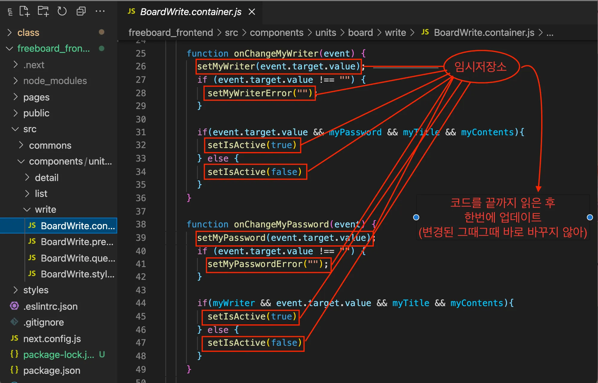

# 리액트의 데이터 흐름

지난 시간에 배웠던 것 처럼 **리액트의 데이터 흐름은 단방향** 입니다.

즉, **부모에서 자식으로만 전달이 가능**하다는 뜻 입니다.

그래서 **`props`** 를 배울 때 우리는 **`부모 컴포넌트가 자식 컴포넌트에게 물려주는 변수/ 함수`** 라고 알려드렸습니다.

데이터 흐름이 단방향이라는 사실은 꼭 기억하고 계시길 바랍니다.

### 레벨업!

> **💡 props drilling?**
→ **`props가 자식에게 넘겨주는 단계가 두단계 이상될 경우를 우리는 props drilling이 일어났다`** 고 합니다.
props drilling은 과도하지 않으면 괜찮지만, 과도하게 이루어지면 해당 props가 어디서 내려지고 있는지 찾는것이 굉장히 난해해집니다.
따라서 최대한 drilling이 안일어나게 해주시는 것이 코드의 가독성과 유지보수 면에서 유리합니다.
**props drilling을  방지하기 위해서는 global state를 이용**하는것이 좋습니다.

❗️ global state는 추후에 자세히 배우는 내용으로 지금은 모르셔도 괜찮습니다.
>


# 버튼 활성화 기능 만들기

## **state**로 버튼 활성화 만들기

리액트에서는 **상태(state)**라는 개념을 이용해 컴포넌트의 데이터를 관리하고, 그 데이터에 따라 화면의 UI를 동적으로 변경할 수 있어요. 여기서는 **버튼을 활성화**(활성화된 상태에서만 클릭 가능)하거나 **비활성화**(클릭 불가능)하는 기능을 만들어보겠습니다.

### 버튼 활성화의 기본 원리

- **버튼을 비활성화(클릭 불가) 상태로 시작**하고, 입력 필드들이 모두 채워지면 버튼을 활성화(클릭 가능)하는 방식입니다.
- 이때 버튼이 활성화될지 비활성화될지 결정하는 중요한 값이 바로 **`isActive`**라는 state입니다.

## state를 사용해 하드코딩으로 버튼 활성화 만들기

하드코딩 방식으로 먼저 간단하게 state를 이용해 버튼을 활성화/비활성화해보죠.


```javascript
import { useState } from "react";

const SimpleButtonToggle = () => {
  const [isActive, setIsActive] = useState(false);  // 처음엔 버튼 비활성화

  const onClickToggle = () => {
    setIsActive(!isActive);  // 버튼 클릭 시 활성화/비활성화 전환
  };

  return (
    <>
      <button onClick={onClickToggle} disabled={!isActive}>
        {isActive ? "비활성화" : "활성화"} 버튼
      </button>
    </>
  );
};

export default SimpleButtonToggle;
```

위 코드에서:

- **`isActive`**가 `false`면 버튼이 비활성화되고, `true`면 활성화됩니다.
- 버튼을 클릭할 때마다 **`setIsActive`**를 통해 상태를 반전시켜 버튼의 활성화 상태를 변경합니다.

# state 리렌더

## 리액트가 리렌더하는 방식

setState는 비동기로 작동 합니다. 

setState가 동기로 작동하게되면 변경될때마다 **바로 바로 렌더링을 하기 때문에 비효율적**입니다.

따라서 **임시 저장소에 모아두었다가  코드를 끝까지 읽고 한번에 바꿔서 렌더링합니다.**



## **`setState`의 동작 원리 3단계**

`setState`가 어떻게 동작하는지 3단계로 설명드리겠습니다.

1. **비교 (Comparison)**
    - `setState`를 호출하면, 리액트는 이전 상태와 새로운 상태를 비교하기 시작합니다.
    - 상태가 변경되었는지 확인하기 위해 얕은 비교(shallow comparison)를 수행합니다.
    - 예를 들어, 객체의 상태가 변경될 경우 리액트는 객체의 참조(reference)를 비교하여 변경 여부를 판단합니다.
2. **변경 (Update)**
    - 리액트는 상태 변경이 필요하다고 판단되면, 상태를 비동기적으로 업데이트합니다.
    - 이 단계에서 상태가 즉시 변경되는 것이 아니라, 비동기 큐에 상태 변경 요청이 쌓이게 됩니다. 이로 인해 `setState`를 여러 번 호출하더라도 성능을 최적화하기 위해 한 번에 배치(batch)하여 업데이트합니다.
    - 이 과정은 리액트의 내부 스케줄러에 의해 관리됩니다. 이러한 비동기적 특성 때문에 `setState`를 호출한 직후의 상태 값은 바로 반영되지 않을 수 있습니다.
3. **렌더 (Render)**
    - 상태가 변경된 후, 리액트는 해당 컴포넌트를 다시 렌더링합니다.
    - 이때, 변경된 상태값을 기반으로 새로운 UI가 만들어집니다. 리액트는 효율적으로 DOM을 업데이트하기 위해 변경된 부분만 렌더링합니다.
    - 즉, **가상 DOM(Virtual DOM)과 실제 DOM을 비교하여 변경된 부분만 실제 DOM에 적용하는 방식입니다.**

    ### **레벨업!**

> 💡**`리렌더가 되는 상황`**
1. 새로운 props가 들어올 때
2. 부모 컴포넌트가 렌더링 될 때
3. 강제 업데이트(forceUpdate)가 실행될 때
4. state가 변경될 때
>

> 💡**`setstate의 비동기적 특성`**
> 
> 
> **아래의 버튼을 클릭하면 어떤값이 나올까요?**
> 
> → 정답은 1입니다. 
>    이는 setState가 비동기적 특성을 갖기때문입니다.
>    (동기적으로 작동했다면 코드를 읽고 바로 내려가서 또 1을 더하고 또 1을 더해 3이 나왔을 것 입니다.)
>
```javascript
export default function stateTest(){
const [value,setValue]=useState(0)

const onClick = () => {
    setValue(value+1)
    setValue(value+1)
    setValue(value+1)
  }

  return (
    <div className="App">
      <button onClick={onClick}>+</button>
      <h1>{value}</h1>
    </div>);
}
```