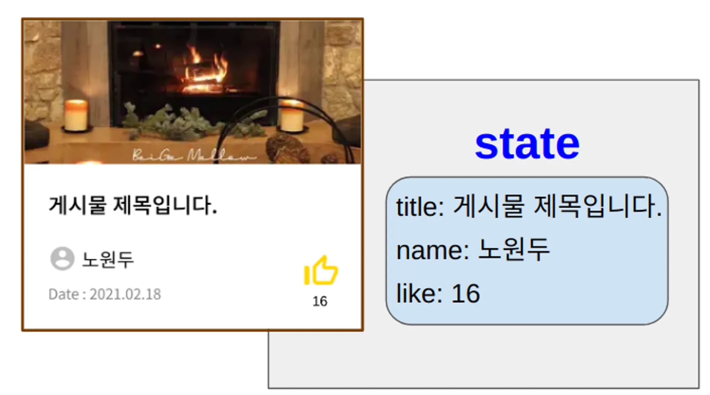

# props

컴포넌트를 2개로 나누면서 데이터와 기능의 연결고리가 끊어지게 됩니다. 

이를 **props가 연결**해주게 되며, **`props란 부모 컴포넌트가 자식 컴포넌트에게 물려주는 변수/함수`** 를 의미합니다.

부모 컴포넌트가 props를 물려줄때는 객체로 묶어서 넘기게 됩니다.

 ### props를 내려주기 _ 부모 컴포넌트

 ```jsx
// input.js
const 영희의인풋 = (훈이의props) => {

    console.log("==============================")
    console.log("나는누구게: ", 훈이의props.나는누구게)
    console.log("props: ", 훈이의props)
    console.log("철수가방: ", 훈이의props.철수가방)
    console.log("영희가방: ", 훈이의props.영희가방)
    console.log("==============================")

    const 초기메시지 = "비밀번호를 입력하세요"

     /* 바벨이 진짜 HTML로 바꿔줌(이건 JS로 흉내낸 가짜 HTML => JSX) */
    return (
        <input type="text" placeholder={초기메시지} />
    )
}
 ```

 props는 여러개를 내려 줄 수 있습니다. 

위와 같이 props를 넘기게 되면, **훈이의props: { 철수가방: 철수의사과, 영희가방: 영희의사과, 나는누구게: "함수" }** 형태의 **객체로 넘어가게** 됩니다.

###  props 받아오기
```jsx
// ...
<script type="text/babel" src="./input.js"></script>
<script>
	const root = ReactDOM.createRoot(document.getElementById('root'));
	
	/* 1. 변수는 중괄호에다가 쓰면 알아서 바벨이 진짜 HTML로 바꿔줌 */
	/* 2. 함수는 태그에다가 쓰면 알아서 바벨이 진짜 HTML로 바꿔줌 */
	
	const 철수의사과 = 3
	const 영희의사과 = "사과없어요"
	
	root.render(
		<div>
			{영희의인풋({ 철수가방: 철수의사과, 영희가방: 영희의사과, 나는누구게: "함수" })}
	              
			<영희의인풋 철수가방={철수의사과} 영희가방={영희의사과} 나는누구게="컴포넌트" />  {/* 자동으로 객체로 묶여서 전달됨 */}
		</div>
	);
</script>
// ...
```
파라미터 부분에 props를 적지 않으면 받아 올 수 없으니 주의 해주셔야 합니다.

또한 **객체로 넘어오기 때문에** 받아온 props를 사용하려면 객체의 속성을 꺼내오는 것 처럼 사용해주셔야 합니다. 따라서 **props.propsName 형태**로 사용해야 합니다.

## 리액트의 단방향 데이터 흐름

리액트는 **데이터 흐름이 단방향 구조**입니다. 

데이터 흐름이 단방향 구조라는 것은 **props는 부모가 자식에게만 줄 수 있으며**, **자식이 부모에게 줄 수 없다는 것**을 의미합니다.

리액트의 데이터 흐름이 단방향 구조이기때문에 우리가 에러를 캐치하기가 더 쉽고, 보기에 더 깔끔합니다.


> 💡 **props 구조 분해 할당으로 받아오기**
→ 구조 분해 할당으로 props를 받아오게 되면, **props.propsName이 아닌** **propsName만 적으면 되기 때문**에 조금 더 편리하게 사용할 수 있습니다.

→ 또한 , 구조 분해 할당으로 props를 받아오면 **필요한 것만** 받아올 수 있습니다.
부모컴포넌트는 하나지만, 자식 컴포넌트가 여러개인 경우 구조분해 할당이 props를 내려주고 받는데 조금더 편리 합니다.
 
(예시)
> 
> 
> ```jsx
> //구조분해 할당으로 props 받아오기 
> 
> //기존 파라미터 부분에는 props라고 적어 props의 모든것을 받았습니다.
> export const function BoardWrite({handleInput, handleChange}){
> 
> //기존 방법은 props.handleInput , props.handleChange 입니다. 
> <input onChange={handleInput}
> <button onClick={handleChange}
> }
> ```
> 

**구조분해 할당(비구조화 할당)은 이후에 조금 더 자세히 다루게 됩니다. 지금은 props를 이렇게도 받아올 수 있다 정도만 알아두셔도 좋습니다.**

# state 친구들 (state, setState, useState)

**`state란 리액트 컴포넌트에서 데이터를 담기 위한 상자`**입니다.

우리는 자바스크립트에서 데이터를 담기 위한 상자로 **`변수`**를 배웠습니다.

다시 말해, **`state는 컴포넌트에서 사용하는 변수`**입니다.

> **state**: 컴포넌트에서 사용하는 **`변수(state)`
setState**: 컴포넌트에서 사용하는 **`변수(state)를 바꿔주는 기능`
useState**: 컴포넌트에서 사용하는 **`변수(state)를 만들어주는 기능`**
>

1. useState로 State변수 만들고, 바꾸기

```javascript
// 자바스크립트에서 변수 만들기
변수만드는기능 변수명 = 담을내용           ==>    let classmate = "철수"

// 리액트 컴포넌트에서 변수 만들기
const [변수명] = 변수만드는기능(담을내용)  ==> const [classmate] = useState("철수")
```
```javascript
// 자바스크립트에서 변수 바꾸기
let classmate = "철수"classmate = "영희"       // classmate 가 영희로 바뀝니다.

// 리액트 컴포넌트에서 변수 바꾸기
const [변수명, 변수바꾸는기능] = 변수만드는기능(담을내용) 
const [classmate, setClassmate] = useState("철수")
setClassmate("영희")     // classmate 가 영희로 바뀝니다.
```

### **2. 리액트에서 let을 안쓰고 state를 변수로 사용하는 이유**

리액트 컴포넌트는 앞쪽에 **`화면에 보여지는 부분`**과 뒷쪽에 **`데이터를 관리하는 부분`**으로 나눌 수 있습니다.



만약, 단순히 **`자바스크립트 변수 let(또는 상수 const) 를 사용`**해서 카운트를 화면에 그렸다면, 카운트가 변경되었을 때, **`뒷쪽의 데이터 부분만 변경되고, 앞쪽 화면에는 반영이 되지 않습니다.`**

화면에 반영 되길 원한다면, **`document.getElementById(”count”)innerText`** 를 이용해서 화면에 반영하셔야 합니다.

하지만, **`컴포넌트 변수 state를 사용`**해서 화면에 그리고, **`setState()를 사용해서 좋아요를 변경하면`**, **`setState() 안에서 화면을 새롭게 그리라는 명령이 실행`**되어 변경된 데이터가 화면에 새로 그려집니다.

```javascript
const 카운터 = () => {
   const [카운트, 카운트변경해라] = React.useState(0)

   const 카운트올리는기능 = () => {
      카운트변경해라(카운트 + 1)
   }

   const 카운트내리는기능 = () => {
      카운트변경해라(카운트 - 1)
   }

   /* 함수의 리턴은 1개만 할 수 있음 => 따라서, 어떻게든 하나로 묶어서 리턴해야됨  */
   return (
       <div>
           <div>{카운트}</div>
           <button onClick={카운트올리는기능}>카운트 올리기!!!</button>
           <button onClick={카운트내리는기능}>카운트 내리기!!!</button>
       </div>
   )
}
```