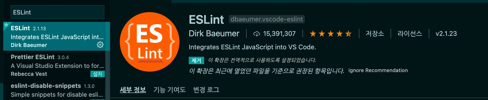
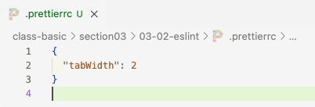

# 코드의 규칙 정하기

우리는 협업시에 팀단위로 코딩을 하게 됩니다. 따라서 각자의 코드 스타일이 다르게 됩니다.

이렇게 다양한 사람들고 협업을 하게 되면서 **일정한 규칙**을 정하게 되면, 일이 조금 더 수월하게 진행이 가능합니다.

## 코드린터와 코드 포멧터

- **코드 린터** 는 **문법에서 에러는 아니지만 에러로 약속하자고 규칙을 정하는 것** 입니다.
    
    에러는 아니라 규칙에 어긋나는가를 검사하기 때문에 vscode에서 빨간 줄이 그여도 실행하는데는 아무 문제가 없습니다.
    
    **`코드린터 : eslint`**
    
    eslint 의 규칙으로는 **import 순서, ==금지** 등이 있을 수 있습니다. 또한 eslint자체에 포메터 기능도 어느정도 가지고 있습니다.
    

- **코드 포메터**는 **코드를 보기 좋게** 만들어주는 것 입니다.
    
    **`코드 포메터 : prettier`**
    
     prettier의 규칙으로는 **띄어쓰기 2칸,-길이 넘으면 줄바꿈** 하기 등이 있습니다.

     eslint 설치하기

     ```bash
     npm init @eslint/config@latest
     ```

     설정파일을 만들고 나면 아래와 같이 몇가지 질문이 나옵니다.  키보드를 이용해 움직여 선택하시면 됩니다.

```Typescript
     //eslint를 어떤식으로 사용할지에 대한 질문입니다. 우리는 문법과 코드스타일과 문제모두 체크해야하므로 마지막것을 체크합니다.
How would you like to use ESlint ?
=> To check syntax only / To check syntax and find problems

//자바스크립트 뭐쓰고 있는지 묻는것 입니다. 우리는 import/export를 지원하는것을 사용합니다.
Waht type of modules does your project use? 
=> Javascript modules (import/export) / CommonJs (require/exports) / None of these

// 우리는 리액트를 사용하므로 react를 선태해주시면 됩니다.
Which framework does your project use? 
=> React / Vue.js / None of these

//타입스크립트 사용유무를 확인하는 질문입니다. 우리는 타입스크립트를 사용하므로 yes를 선택합니다.
Does your project use TypeScript? 
=> No / Yes

// 어디서 실행하는지 확인하는 질문입니다. 우리는 브라우저에서 실행합니다.(노드는 언어가 아닌 실행기입니다.)
Where does your code run? 
=> Browser / Node

The config that you've selected requires the following dependencies:

eslint, globals, @eslint/js, typescript-eslint, eslint-plugin-react

// 지금까지 설정한 eslint를 설치할지 확인하는 질문입니다.
Would you like to install them now?
=> No / Yes

// 어떤 패키지 매니저로 설치할지 묻는 질문입니다.
Which package manager do you want to use? 
=> npm / yarn / pnpm / bun 
```

위의 **규칙들은 각 프로젝트의 상황마다 다르게 설정**할 수 있습니다. 우리는 지금 Codecamp에 맞추고 있습니다.

앞으로 여러분들이 하는 프로젝트, 회사마다 설정이 다를 수 있습니다.

**설치가 완료**되면, **eslint.config.mjs 파일이 생성**된 것을 보실 수 있습니다.

그리고 App.tsx를 켜보시면 빨간줄이 많이 생긴 것을 볼 수 있으며, 이는 **standard라는 규칙에 어긋났다**라는 뜻 입니다.


❗️ eslint가 불편해요!
→ eslint.config.mjs에 들어가서 아래와 같이 rules에 불편한 규칙을 추가해주시고 해당 규칙을 off 해주시면 됩니다.

```javascript
// 필요없는 규칙은 off해서 꺼주세요
rules: {
    'react/react-in-jsx-scope': 'off',
 }
```
**ESLint,prettier Extention 설치** 

**eslint를 설치했음에도 불구하고 빨간줄이 안나온다면**, 아래 두 extention을 설치해주세요.

추가로 VS code extension에서 ESLint를 설치해주세요




## ESLint에 잡힌 오류 확인하기

eslint에 잡힌 오류는 파일을 하나하나 다 돌면서 확인 할 수 없기 때문에 명령어 하나로 어떤부분이 에러로 잡혔는지 볼 수 있습니다.

package.ujc 4에 명령어를 설정해봅시다.(아래
는 예시이므로 원하는 명령어를 설정하시면 됩니다.)


아래 명령어를 사용하면 여러분들의 모든 파일을 eslint가 검사하여 어떤 부분이 잘못된 부분이 있는지 체크해줍니다.

```bash
yarn lint
```

# prettier 설치

**Prettier**는 코드를 일관된 스타일로 포맷팅해 주는 도구입니다. 팀 내 모든 개발자가 동일한 코드 스타일을 유지하도록 도와주며, 특히 저장할 때 자동으로 코드를 포맷팅하는 기능을 제공합니다. 이는 코드의 가독성을 높이고, 불필요한 스타일 논쟁을 줄여 개발 속도를 향상시킬 수 있습니다.

prettier 설치 명령어 입니다.

```shell
yarn add --dev --exact prettier
```

아래의 명령어로 `.prettierrc.5678` **설정파일을** 생성합니다.

혹은 + 버튼을 눌러서 직접 파일을 만들어주셔도 됩니다.

```shell
echo {}> .prettierrc.json
```

만들게 되시면 `prettierrc.json`파일에 비어있는 객체를 보실 수 있습니다.

해당 파일에 prettier 설정을 추가해줄 수 있습니다.

아래 사진은 예시로 들여쓰기 설정을 해준 모습입니다.



* 프론트엔드 강의 노션 파일 참조