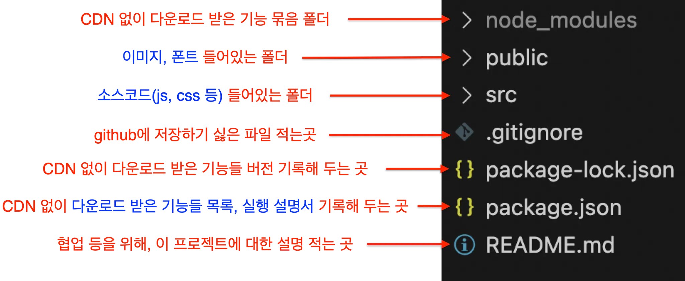
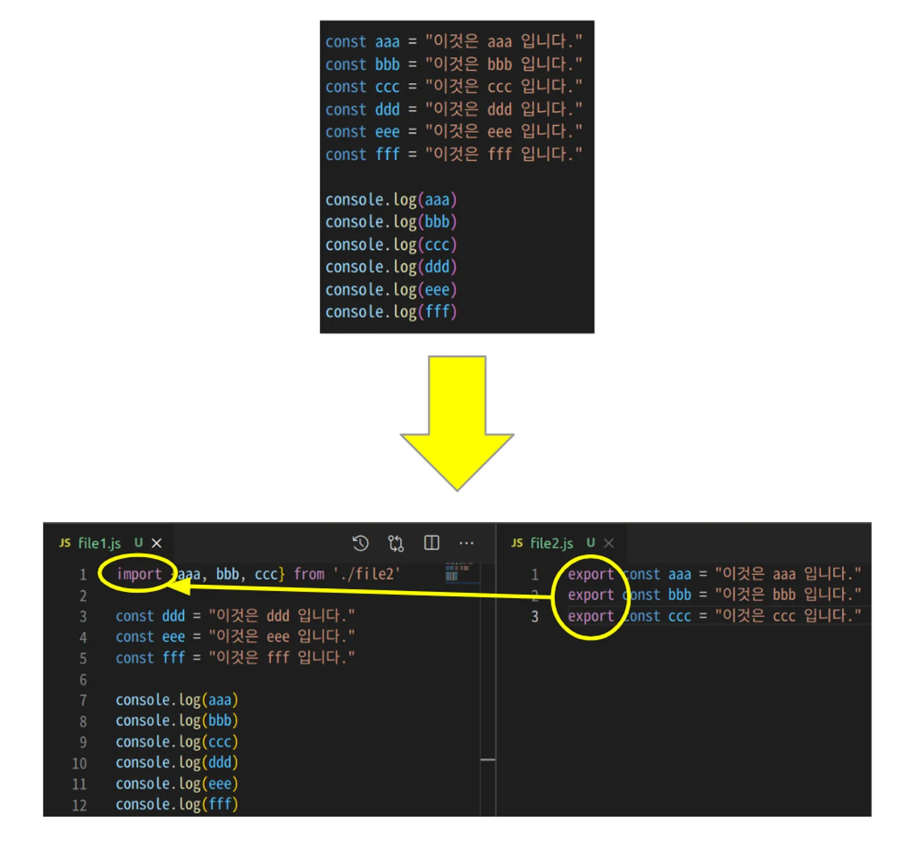
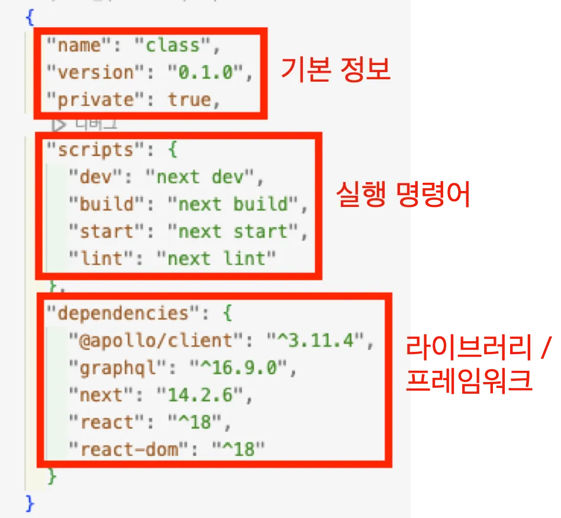

# React 폴더구조

다음은 설치된 프로젝트의 초기 폴더 구조입니다.

### 보일러 플레이트

우리는 이렇게 **`초기 셋팅이 완료된`** 폴더를 **`보일러플레이트`**라고 합니다.

(보일러플레이트는 회사마다 다를 수 있습니다.)

각 폴더의 한 줄 요약입니다.


# 다른 폴더의 파일 불러오기( **import / export** )

React에서 다른 폴더에 있는 파일을 불러올 수 있습니다.

예를들어, 한글 문서를 작성할 때도, 하나의 파일에 모두 작성하지 않고, 여러개의 파일에 종류별로 나누어서 작성하면 효율적으로 관리할 수 있습니다.



💡 실무적용 - { import / export } 언제 사용하나요?
우리가 만드는 소스코드는 주로 HTML, CSS, JAVASCRIPT입니다.
이 때, 하나의 소스코드에 이 모든 내용을 코딩하면 너무 복잡해 집니다.
HTML, CSS, JAVASCRIPT를 작성하는 소스코드 파일을 각 각 따로 만들고, 필요에 따라 서로 불러와서 사용하게 됩니다.

# CRA 구조 소개

## package.json이란?

**`package.json`**파일은 핵심이 되는 파일로, **`제품 설명서`**와 같은 역할을 합니다.



### **`node_modules` 지우고 다시 설치하는 방법**

때때로 문제가 발생할 수 있습니다. 이럴 때 가장 쉬운 해결 방법 중 하나는 `node_modules` 폴더를 삭제하고 다시 설치하는 것입니다.

1. `node_modules` 폴더와 `package-lock.json`(또는 `yarn.lock`) 파일을 삭제합니다. 프로젝트 루트에서 다음 명령어를 실행하세요:

```shell
rm -rf node_modules
rm package-lock.json  # 또는 yarn.lock
```
2. 의존성을 다시 설치합니다:
```shell
yarn install
```

# 리액트 실행 및 실습

### **`yarn dev` 실습 및 HTML, CSS 변경**

`yarn dev` 명령어는 개발 서버를 시작하는 명령어입니다. 이 명령어를 실행하면 브라우저에서 프로젝트를 확인할 수 있습니다.

1. 터미널에서 프로젝트 루트로 이동한 후, 다음 명령어를 실행하세요:
    
    ```bash
    yarn dev
    ```
    
2. 브라우저가 자동으로 열리거나, 터미널에 표시된 URL(보통 `http://localhost:3000`)을 브라우저에 입력합니다.
3. 이제 `src/App.js` 파일을 열어 HTML과 CSS를 변경해 봅시다. 예를 들어, `<h1>Hello, React!</h1>`라는 코드를 추가하거나 변경해 보세요.
4. 변경 사항을 저장하면, 브라우저가 자동으로 새로 고침되어 변경된 내용을 확인할 수 있습니다.

### **`Ctrl + C` 눌러서 종료하는 방법**

개발 서버를 실행 중일 때, 서버를 종료하고 싶다면 `Ctrl + C`를 누르면 됩니다.

- 터미널에서 `Ctrl` 키와 `C` 키를 동시에 눌러서 서버를 중지할 수 있어요.
- 그러면 터미널에서 커서가 깜빡이는 상태로 돌아오게 되고, 다른 명령어를 입력할 수 있습니다.s