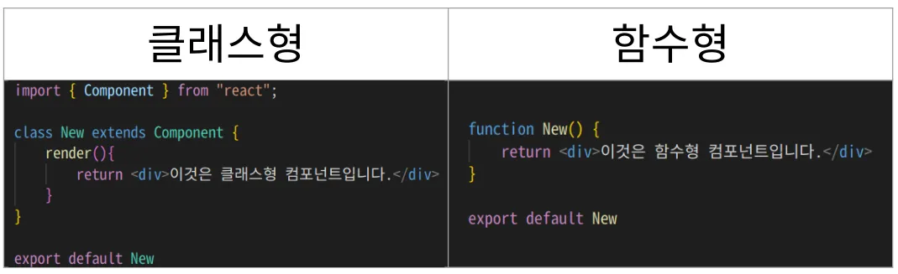
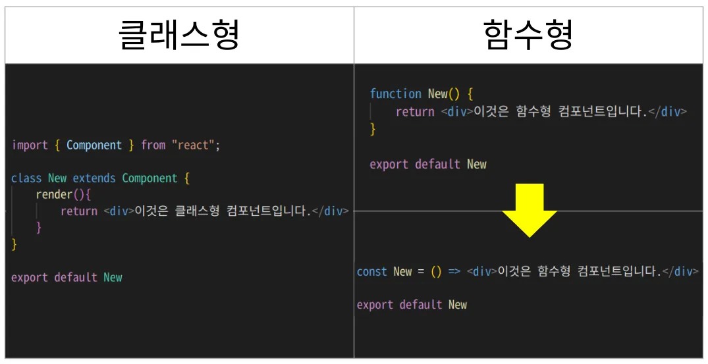

# 클래스형 컴포넌트 vs 함수형 컴포넌트

React에서 **`컴포넌트 작성 방법은 2가지`**가 있습니다.

함수형이 훨씬 간단해 보입니다. 함수형은 화살표함수로도 적용 가능합니다.

❗️ 실무적용 - { 클래스형, 함수형 } 언제 사용하나요?
React는 처음에 클래스형 방법만 존재했습니다. 
하지만 클래스형은 어렵고, 복잡하여 이후에 함수형 컴포넌트 방법이 추가되었습니다.
최근에는 많은 기업이 함수형 컴포넌트를 주로 사용합니다.하지만, 기존에 이미 만들어진 서비스들은 클래스형으로 되어있는 경우도 많으므로, 클래스형도 알아둘 필요가 있습니다.