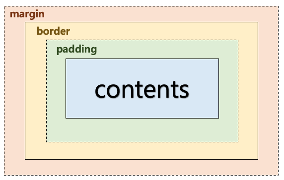
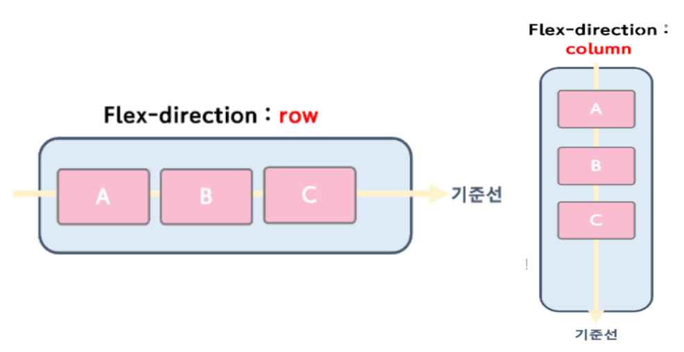
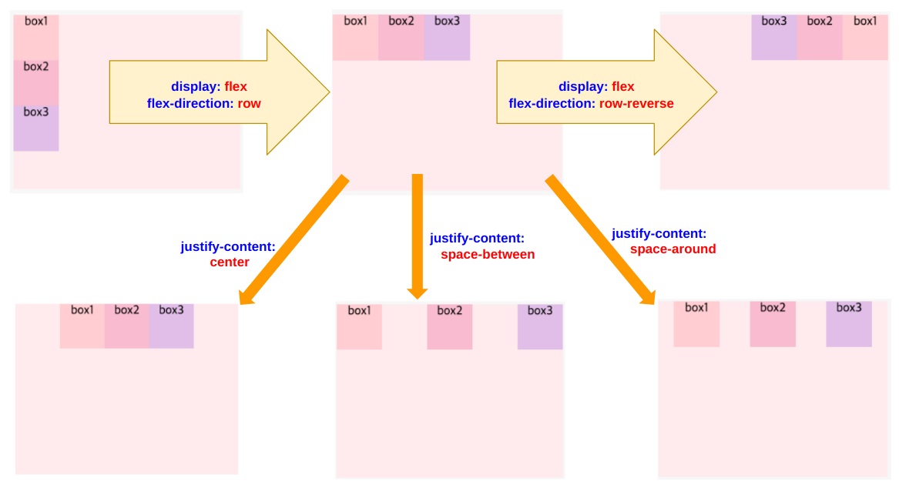
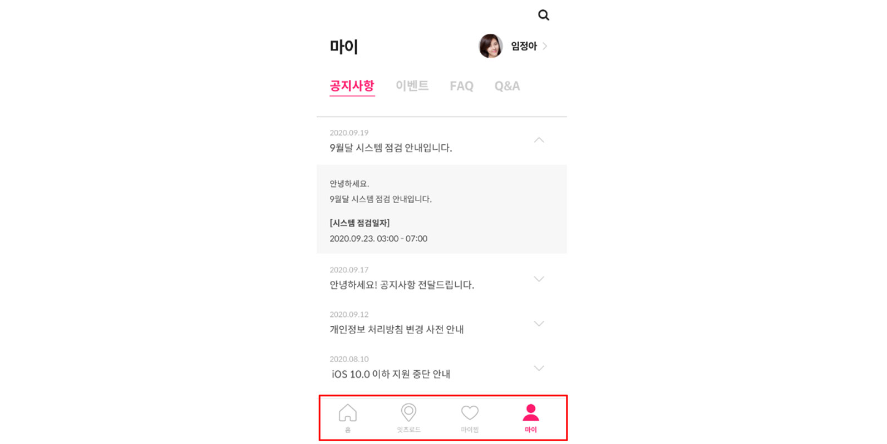

```
✅ margin 
: border를 기준으로 박스의 **바깥 여백** 입니다.

✅ border
: **박스의 기준이 되는 바깥 테두리 선**입니다. 선의 두께를 설정할 수 있습니다.

✅ padding
: 박스의 **안쪽 여백** 입니다.

✅ border-box : border가 고정되고 contents 크기가 변합니다. (박스가 고정)
✅content-box : contents가 고정되고 border의 크기가 변합니다. (박스가 커짐)

❓ 실무적용 - { border-box, content-box 각 각 } 언제 사용하나요?
실무에서는 박스 크기를 디자이너가 전달해준 화면과 일치시켜야 하기 때문에 바깥테두리(박스전체)를 고정시키는 border-box 사용을 권장합니다.
```



```
✅ 정렬

CSS 에서 가장 중요한 부분중의 하나가 정렬입니다.
어떤 요소를 원하는 위치에두고 사용자가 접근하기 편한곳에 두는것 또한 CSS에서 굉장히 중요한 요소 중 하나이기 때문입니다.
정렬의 방법으로 가장많이 사용되는 방법으로는 flex,  position,  grid가 있습니다.

✅ Flex
flex의 핵심은 여러태그를 하나로 묶어 정렬하는데에 있습니다.
정렬하는데 중요한 점은 정렬시 기준이 필요하다는 점 이며, flex는 기준을 부모박스로 두고 움직이게 됩니다.
```


```
Flex는 실제 내용이 있는 **빨간색의 자식박스**들이 있고, 내용들을 정렬하기위해 감싸고있는 **파란색의 부모박스**로 이루어져 있습니다.

Flex의 정렬 핵심은,`파란색의 부모박스`안에 `빨간색의 자식박스`를 `가로(row)`또는 `세로(column)`로나열하고, 부모박스로 자식박스들을 정렬하는 것입니다.
```



```
✅ position

flex에 종속되지 않고, 박스를 개별적으로 위치시킬 수 있습니다.

/* 박스의 절대 위치 */
div {
    position: absolute;
    top: 0px;
    left: 0px;
}

/* 부모 박스 기준으로 상대위치 */
div {
    position: relative;
    top: 0px;
    left: 0px;
}

/* 화면을 기준으로한 절대 위치 */
div {
    position: fixed;
    bottom: 0px;
}
```
```
❓ position: fixed 언제 사용하나요 ㅓㅜㅡ?
화면을 기준으로 고정시키고 싶은 박스가 있는 경우에 사용합니다.
아래는 화면의 맨 아래쪽에 내비게이션바를 고정시키는 경우입니다.

<!-- 모바일 내비게이션바 화면 하단에 고정하기 -->
<head>
    <style>
        .wrapper {
            position: fixed;
            bottom: 0px;
            }
    </style>
</head>
<body>
    <div>
        <div class="wrapper">
            <div>홈</div>
            <div>잇츠로드</div>
            <div>마이홈</div>
            <div>마이</div>
        </div>
    </div>
</body>


```

