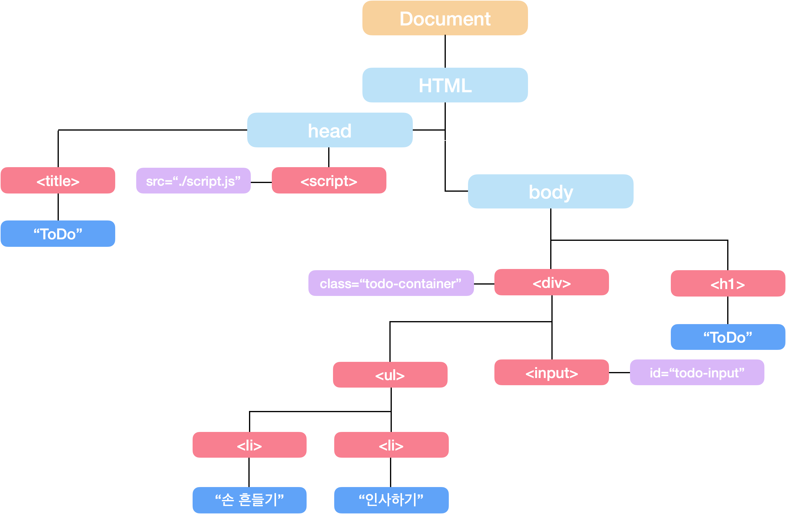

우리는 **`JavaScript로 HTML 문서를 조작`** 할 수 있습니다.
항상 document라고 하는 객체를 참조해와서 내부의 HTML 요소들을 참조하는 방식으로 그 문서의 내용을 조작했죠. 그런데 사실 우리는 **HTML 요소들을 직접적으로 조작했던 것이 아닙니다.**
조금 더 정확하게 이야기 하자면, 우리는 **`DOM Element`** 를 조작했던거예요.

## DOM

브라우저는 **HTML 문서를 파싱하는 과정에서 DOM이라는 트리구조 형태의 객체를 생성**하게 됩니다.
**트리 구조란,** 자료구조의 일종으로 **여러개의 노드로 구성**되어 있으며 **하나의 부모가 여러개의 자식 노드**를 가지게 되는 형태를 이야기합니다.

우리는 DOM 트리를 살펴보며 트리구조가 가지게 되는 기본 형태를 살펴보도록 하겠습니다.

DOM 트리 구조는 간단하게 표현하자면 위와 같습니다. 각 요소들은 **`노드(Node)`** 라는 이름으로 불리우게 됩니다. 해당 구조를 토대로 DOM 트리를 간단하게 살펴보겠습니다.

> **DOM 트리**
> 
> - **Document**
> 문서(document) 노드, DOM에 진입할 수 있는 진입점 역할을 해준다.
> - **HTML**
> Document를 제외하고 최상위에 위치, 이러한 노드를 루트(root) 노드라고 한다. 루트 노드는 항상 하나만 존재합니다.
> - **head, body, title, div…**
> 요소(element) 노드라 부른다. 속성 노드를 가질 수 있는 유일한 node입니다.
> - **src=”…”, id=”…”**
> 속성(attribute) 노드라 부른다. 이들은 요소 노드에 관한 별도의 정보를 담고 있지만, 해당 요소 노드의 child node에는 속하지 않는다.
> - **“ToDo”, “인사하기”…**
> 텍스트(text) 노드라고 부른다. 텍스트 노드는 child node, 자식 노드를 가질 수 없기 때문에 항상 leaf node가 된다.
> 
> **Parent Node** : 각 node의 바로 위에 위치한 Node를 Parent Node, 부모 노드라 한다.
> **Chile Node** : 각 node의 바로 아래에 위치한 Node를 Child Node, 자식 노드라 한다.
> **Leaf Node** : 트리구조 내에서 가장 끝단에 위치한, Child Node가 없는 Node를 가리킨다.
> 

그리고 우리는 document를 활용해서 **`JavaScript 내부로 각각의 Node들을 참조`** 해 올 수 있었습니다.

아래는 간단한 DOM 관련 메소드 목록입니다.

> **DOM Method**
> 
> - **document.getElementById()**
> ⇒ Element Node의 id 속성을 체크해서 해당하는 Element를 참조해온다.
> - **document.getElementByClass()**
> ⇒ Element Node의 class 속성을 체크해서 해당하는 Element를 참조해온다.
> - **document.querySelector()**
> ⇒ 소괄호 안에 입력한 값에 해당하는 Element를 참조해온다. id(”#”)를 입력하는 경우 id를 기반으로, class(”.”)를 입력하는 경우 class를 기반으로 참조
> - **document.querySelectorAll()**
> ⇒ 소괄호 안에 입력한 값에 해당하는 Element를 참조해온다. querySelector와 다르게 배열 형태로 모든 요소를 참조해온다.
> - **document.createElement()**
> ⇒ 새로운 Node를 생성합니다. Node의 형태는 생성되지만 DOM에 직접 추가해주는 과정을 거치치 않으면 DOM에 속하지 않습니다.
> - **document.appendChild()**
> ⇒ Element Node를 현재 DOM에 추가합니다. 이때의 document는 다른 Element가 될 수도 있습니다.

이외에도 다양한 기능을 가진 메소드들이 존재합니다.