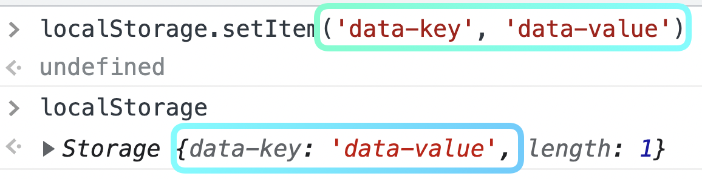
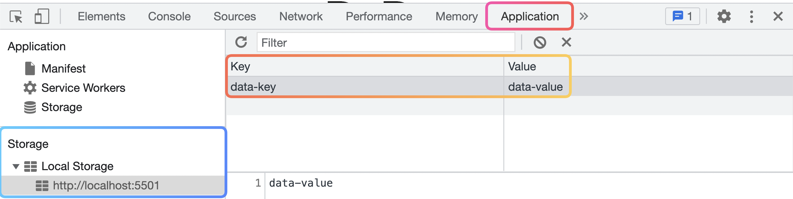
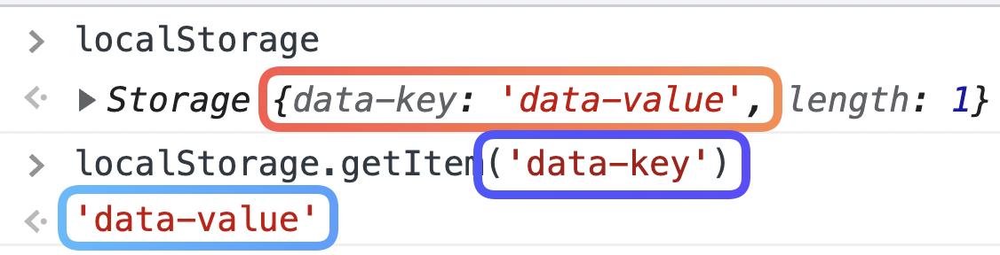

# 브라우저의 Web Storage

웹 브라우저에서 어떠한 로직에 활용되는 데이터를 유지시키고자 한다면, 해당 데이터를 저장할 공간이 필요합니다. 웹 브라우저는 **`Web Storage라고 하는 저장소를 제공`** 하는데, **`seesionStorage`** 와 **`localStorage`** 를 활용할 수 있습니다. 

두개의 storage는 공통점을 가지게 됩니다.  먼저 두 storage 모두 **`local 환경에 데이터를 저장`** 한다는 특징을 공통점으로 가집니다. 또 다른 공통점으로는 **`데이터가 key-value 형태로 저장`** 이 됩니다. 마치 객체와 같죠.

## localStorage

이번에는 **localStorage**를 알아보죠.
localStorage는 데이터를 **도메인 단위로 저장**이 되며, localStorage에 저장된 데이터는 **`도메인이 같다면 path가 다르더라도 서로 데이터를 공유`** 하게 됩니다.
또한, locaStorage는 **비휘발성 메모리**이기 때문에 저장된 데이터가 **`브라우저, pc를 종료하더라도 그대로 남아있게 되죠.`** 반영구적인 데이터여서 직접 Storage 데이터를 삭제할 때까지 존재합니다.
이러한 특징 때문에 페이지를 재방문 했을 때도 남아있어야 하는 사용자 개별 설정 등의 데이터를 저장하게 됩니다.

> **sessionStorage, localStorage**
> 
> 
> **`sessionStorage`**
> 
> - key-value 형태로 저장
> - 로컬 환경에 데이터 저장
> - 문자열 형태로 데이터 저장
> - 세션 단위로 데이터가 저장
> - 브라우저, 탭을 종료하면 영구 삭제
> 
> **`localStorage`**
> 
> - key-value 형태로 저장
> - 로컬 환경에 데이터 저장
> - 문자열 형태로 데이터 저장
> - 도메인 단위로 데이터가 저장
> - 브라우저, pc를 종료해도 존재


```
Session =>
사용자가 브라우저를 통해 페이지에 접속한 시점부터, 해당 접속을 종료하는 시점까지를 의미하는 단위

Domain =>
url의 프로토콜(http://) 바로 뒷부분에 따라오는 문자를 통해 도메인(localhost)을 확인할 수 있다.
"<http://localhost:5500/user/login>"
"<http://localhost:5500/post>"
// localhost라는 공통된 도메인, 서로 다른 path(/user/login, /post)
```

# local storage 접근 방법

웹 브라우저는 **sessionStorage**와 **localStorage**를 가집니다.
**Web Storage**는 **데이터를 저장하는 공간**이죠.
그렇다면 데이터를 저장하는 방법과 해당 데이터를 참조하는 방법이 존재할 것입니다.
우리는 JavaScript를 명령어를 사용해서 localStorage에 데이터를 저장하고 참조하는 방법에 대해 알아볼겁니다.

## localStorage.setItem()

localStorage는 `window.localStorage`로 접근할 수 있습니다.
그리고 localStorage의 앞에 적혀지는 window는 생략이 가능합니다.
localStorage에 접근했다면, 이제 데이터를 저장해야겠죠.
데이터를 저장할 때는 localStorage에 **`내장되어 있는 setItem이라는 메서드`** 를 사용하면 됩니다.
```
localStorage.setItem()
```

setItem 뒤에 있는 소괄호 안에 저장할 데이터를 넣어주면 됩니다.
Web Storage의 데이터는 key-value 형태 로 저장이 된다고 했었죠?
소괄호 안에 두개의 인자를 넣어주면 되는데, 첫번째 인자로 key 를, 두번째 인자로 value, 저장할 데이터를 담아주면 됩니다.

localStorage.setItem('data-key', 'data-value')




데이터를 저장했다면, 그 데이터를 활용하기 위해 저장된 데이터를 확인하고 참조해올 수 있어야 겠죠.
먼저 저장된 localStorage 데이터는 개발자 도구 내에서 직접 확인할 수 있습니다.

❗️ localStorage 확인 경로
```
개발자 도구 ⇒ Application 탭 ⇒ >Local Storage 토글
```
해당 위치로 이동해, `토글을 열어 보면` 우리가 저장한 데이터를 확인할 수 있는데요.
localStorage는 도메인 단위로 데이터가 저장되고 관리되기 때문에 현재 접속해 있는 `도메인의 url`을 클릭 해서 우리가 저장한 데이터를 확인할 수 있습니다.



## localStorage.getItem()

localStorage에 저장된 데이터를 JavaScript에서 활용하기 위해서는 **`데이터를 꺼내와야겠죠`**
아래의 명령어로 **`localStorage에 존재하는 데이터를 꺼내올 수 있습니다`**
```
localStorage.getItem()
```

이때, 위의 소괄호 안에는 꺼내오고자 하는 데이터의 key를 적어주시면 됩니다.

```
localStorage.getItem(’data-key’)
```

데이터의 올바른 key를 적었다면, 그와 연결된 값을 가져오게 됩니다.



# 조건문과 Storage 데이터의 조합

localStorage에 저장되어 있는 데이터를 조건문과 결합하면, 사용자가 이전에 어떠한 동작을 수행했는지에 따라 **`다른 분기점을 만들어줄 수 있습니다.`**
예를 들어 웹 페이지의 타이머를 시작하는 순간 그 내용이 localStorage에 저장되도록 해주는겁니다.
그리고 페이지가 새로 로드될 때, 해당 내용과 관련된 데이터가 lcoalStorage에 저장되어 있는지를 체크해주면 사용자가 이전에 타이머를 시작했었는지 바로 확인이 가능하겠죠?