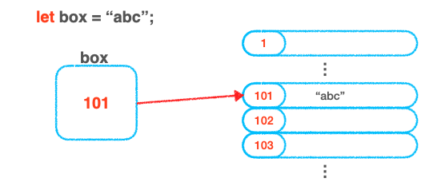
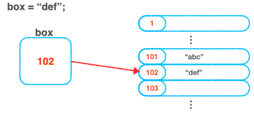
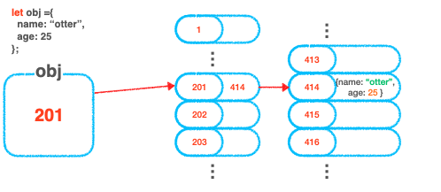

## 원시타입과 참조 타입

사실 자바스크립트의 데이터타입은 크게 두가지 타입으로 나뉘게 됩니다.
바로 **원시타입( Primitive type )** 과 **참조타입( Refrence type )** 입니다.

### 원시타입의 종류

자바스크립트에서의 **원시타입은 아래 7개** 입니다.

- String
- Number
- Boolean
- Bigint
- undefined
- Symbol
- null

### 참조타입의 종류

참조타입의 종류는 위의 7종류를 제외한 나머지 모든 것이 참조 타입입니다.
간단히 설명 드리면 **`참조타입은 객체타입`** 이다 라고 봐도 무방합니다.

### 원시타입의 특징

원시타입은 **`불변성`**이라는 특징을 가집니다.
불변성이란 변하지 않는 속성인데, 말 그대로 데이터가 변하지 않는 속성입니다.
아래 예시에서 자세히 알아보도록 하겠습니다.

우리가 box라는 변수에 ‘abc’라는 문자열을 할당하면 이 문자열은 101이라는 주소를 가진 메모리에 저장됩니다.
이후, 제가 아래와 같이 box에 ‘def’를 재할당 했습니다.

그럼 ‘def’ 는 아까 101주소의 메모리에 저장되어 있는 ‘abc’를 바꾸는 것이 아닌 102주소를 가진 메모리에 ‘def’를 저장 한 후 box에 102번 주소를 가진 메모리를 다시 할당합니다.

이를 우리는 원시타입의 불변성이라고 부릅니다.

### 참조타입의 특징

참조타입의 특징은 눈치채신분도 계시겠지만 원시타입과 반대로 **`가변성`** 을 가지고 있습니다.
가변성은 불변성과 반대되는 속성을 가지고 있습니다.
즉, 101번 주소를 가지고 있던 메모리 값을 수정 할 수 있다는 뜻 입니다.

단, 참조타입에서 주의해야 할 점 이 있습니다. 아래에서 자세히 알아보도록 하겠습니다.

**`414 주소를 가진 메모리`** 에 객체의 정보가 저장되어있습니다.
이 **`메모리의 값은 참조타입의 특징 가변성`** 을 가지고 있습니다. 

즉, 이 **`메모리의 주소는 참조만 해올 뿐 주소가 할당 되는 것이 아닙니다.`**따라서 변화가 가능한 것 입니다.

하지만, 414번 주소를 할당한 **201번 주소를 가진 메모리는 불변성을 지니고 있습니다.**
201번 주소를 가진 메모리는 원시타입의 메모리 주소와 같은 원리를 가집니다.
쉽게 생각해서`객체의 껍데기` 를 `주머니`,`객체의 안에 있는 데이터(property)들` 을 `공` 이라고 하면
**`주머니는 바꿀 수 없지만 , 주머니 안의 공은 바꿀 수 있으며 심지어 삭제와 추가도 가능합니다.`**