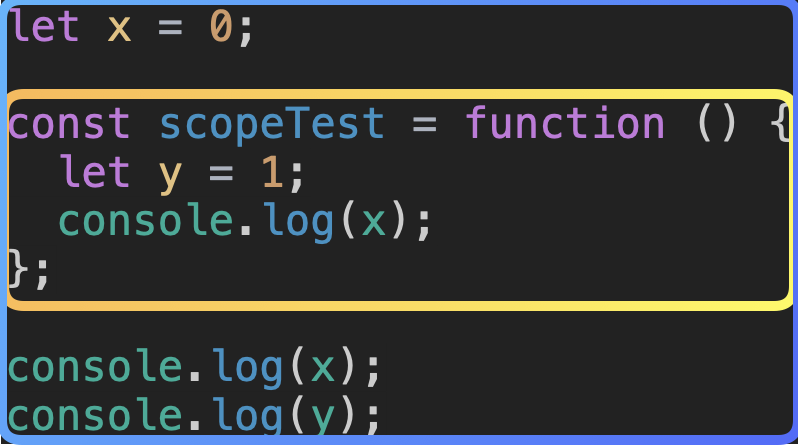
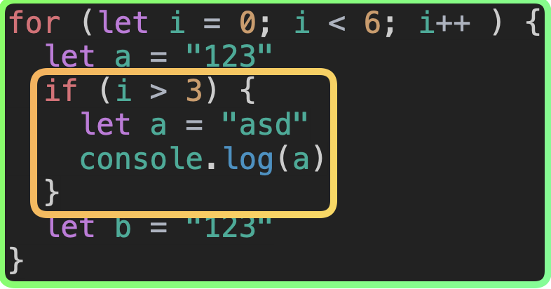
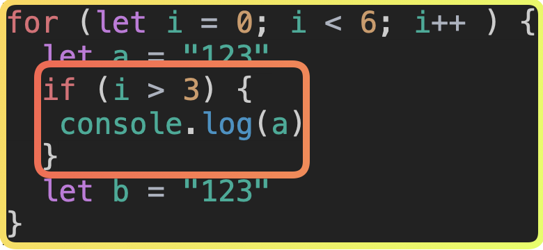
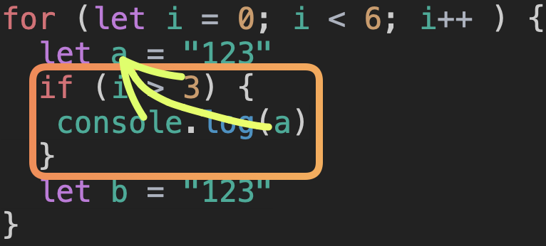

## 함수 스코프

JavaScript에서 지역 스코프를 생성하는 종류는 함수 레벨 스코프와 블록 레벨 스코프가 있습니다.
대부분의 프로그래밍 언어는 블록 레벨 스코프를 따릅니다.
그런데 JavaScript는 과거 함수 레벨 스코프를 따랐었죠.
현재는 let, const 키워드의 등장으로 블록 레벨 스코프를 따를 수 있게 되었습니다.
함수 레벨 스코프란, 함수를 실행할 때 생겨나는 지역 스코프입니다.

위의 예시가 바로 함수 스코프에 의해 생성된 지역 스코프인 것이죠. scopeTest라는 함수에 의해 생성된 스코프이므로 y라는 변수는 해당 지역 스코프 내에만 존재하는 것이죠. 자바스크립트는 이전에 함수 레벨 스코프만 따랐다고 했었습니다. 우리가 마주하지 않으려 노력중인 var 키워드 때문인데요.
JavaScript는 최초에는 var라고 하는 키워드만 존재 했고, var는 함수 레벨 스코프를 따르는 키워드입니다.
그래서 위와 같이 함수가 실행되는 경우에만 해당 지역 스코프가 생성되었었죠.
블록 레벨 스코프를 따르지 않았기 때문에 var 키워드만 사용하던 시기에는 지역 스코프 내에 갇히지 않는 변수가 다수 생성되었고, 전역 스코프로 해당 변수가 들어가게 되었죠. 때문에 전역 변수의 선언을 남발하게 되며 불필요하게 과도한 메모리를 소모하는 문제를 겪었습니다.
이러한 문제를 해결하기 위해 블록 레벨 스코프를 따르는 let 키워드와 const 키워드가 등장하게 되었습니다.

## 블록 스코프

함수 레벨 스코프는 함수를 실행할 때 생성되는, 함수를 기준으로 하는 스코프라고 했었죠?
블록 레벨 스코프는 코드 블록에 의해서 생성되는 스코프입니다.
if문, for문, while문 등 중괄호를 사용해서 코드 블록을 작성하는 환경에서 생성이 되죠.

위 이미지에는 두개의 블록 레벨 스코프가 존재합니다. for문 내에는 a 그리고 b라는 변수가 존재하죠.
그 안에 있는 if 조건문 내부에도 a라고 하는 변수가 똑같이 선언되어 있습니다.
이상하죠? let 키워드는 분명 재선언이 되지 않을텐데 똑같은 변수명으로 두개의 변수가 선언되어 있습니다.
for 블록 레벨 스코프와 if 블록 레벨 스코프는 서로 다른 영역입니다.
그래서 각각의 스코프에서 선언되는 변수는 서로 영향을 주지 않는 것이죠.
let 키워드와 const 키워드는 블록 레벨 스코프를 따르기 때문에 저러한 동작이 가능한 것이죠.
그리고 함수 또한 코드 블록이 생기기 때문에 함수의 스코프에도 영향을 받습니다.

그렇다면 위 코드는 어떨까요?
분명 for문의 블록 스코프와 if문의 블록 스코프는 서로 다르다고 했는데, 저 코드는 에러가 발생하지 않습니다.
if문에 의해서 생성된 블록 스코프 내에 a라는 변수는 존재하지 않음에도 불구하고 정상적으로 for 블록 스코프에 존재하는 a 변수를 참조합니다.

그 이유는 스코프 체이닝 때문인데요.

자바스크립트는 변수를 참조하는 코드를 만나게 됐을 때, 먼저 해당하는 블록 스코프 내에서 변수를 참조하고자 시도합니다. 이때 탐색한 블록 스코프 내에 해당 변수가 존재하지 않는 경우, 상위 스코프로 올라가 다시 탐색을 진행하게 되는데요.

이러한 과정을 스코프 체이닝이라 부릅니다.
그래서 if문에 의해서 생성된 블록 스코프 내에 a라는 변수가 없었음에도 불구하고 에러가 발생하지 않았던거죠.