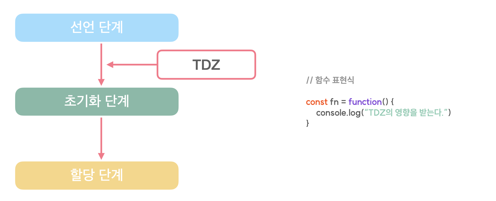
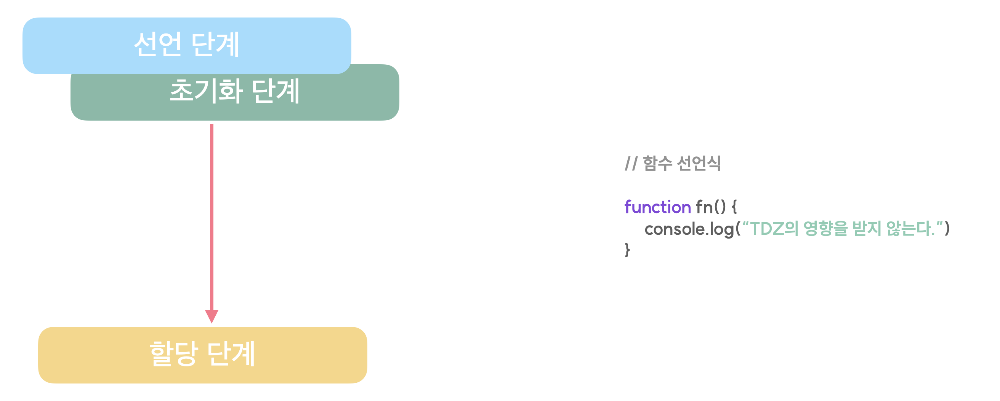

## 호이스팅

호이스팅이란, 함수, 변수의 선언이 마치 위로 끌어올려진 것처럼 동작하는 것을 이야기합니다.
JavaScript에서 이러한 동작이 발생하는 이유는 JavaScript가 코드를 해석하고 실행하는 과정과 내부적인 변수의 선언, 할당 과정 때문입니다.
JavaScript는 코드를 실행하기 전에 먼저 선언된 변수, 함수 등을 전역 환경에 담아두게 됩니다.
그리고 이후에 정리된 코드를 실행하는 과정을 수행하게 되죠.
변수 선언의 관점에서 바라보면 선언된 변수, 함수 등을 전역 환경에 담아두는 시기에 선언 단계라고 하는 과정을 거치게 됩니다.

## 변수의 선언 단계

우리가 선언하는 변수는 선언 단계, 초기화 단계, 할당 단계를 거치게 됩니다.

( 식별자 === 변수명 )
각 단계는 위와 같은 동작을 수행하게 되는데, 초기화 단계를 거치고 나면 해당 변수에 임시 메모리 공간이 할당되기 때문에 부여된 메모리는 존재하나, 값은 존재하지 않는 undefined가 담기게 되는거죠.
초기화 단계는 자바스크립트가 실제로 코드를 실행할 때 해당 변수의 선언 코드를 만나면 수행하게 됩니다.
앞서 우리가 살펴본 let, const 키워드는 마치 호이스팅이 발생하지 않는 것처럼 동작했습니다.
하지만 사실 let과 const도 호이스팅이 발생합니다. 자바스크립트가 실제로 코드를 실행하기 이전에 선언 단계를 거치기 때문이죠.
ㅎ

그런데 왜 let과 const는 선언 코드를 만나기 이전에 참조를 시도하면 에러를 발생시키는 걸까요?
그 이유는 TDZ(Temporal Dead Zone) 때문입니다.
let과 const는 선언 단계와 초기화 단계가 분리되어 실행되는데, 그 사이에는 TDZ가 존재합니다.
초기화 단계를 거치기 전에, 즉 해당 공간에서 머무르는 변수를 참조하려 시도하면 참조 에러(Reference Error)를 발생시키게 되는거죠.
그런데 var 키워드는 조금 다르게 동작합니다.
선언단계와 초기화 단계가 함께 이루어지죠.

즉, 변수를 변수명들이 담기는 전역 객체에 담아주는 과정과 해당 변수에 메모리 공간을 할당해주는 과정이 함께 수행되는 것입니다. 선언 단계와 초기화 단계 사이에 있는 TDZ가 존재하지 않게 되겠죠.
그렇기 때문에 JavaScript가 선언된 변수와 함수를 미리 정리하는 과정에서 이미 임시 메모리를 할당 받았기 때문에 참조 에러가 아닌 undefined를 할당 받았던 것입니다. 이는 함수도 마찬가지 입니다.
우리가 선언한 변수에 익명 함수를 할당하는 함수 표현식은 TDZ의 영향을 받기 때문에 호이스팅이 발생하지 않는 것처럼 동작하고,

선언 키워드가 없는 함수 선언식은 var 키워드로 선언된 변수와 같이 TDZ의 영향을 받지 않고 호이스팅의 영향을 받게 됩니다.
심지어 함수 선언식의 경우는 undefined가 할당되는 것도 아니고 함수 그 자체가 끌어올려진 것처럼 동작하게 됩니다.

