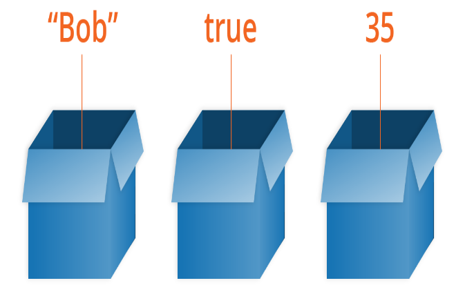
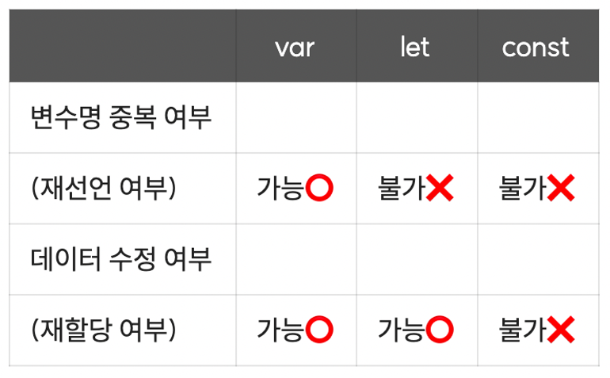

```
✅ 변수와 상수란 무엇일까?

`변수와 상수`는 데이터를 담는 `공간`입니다.
다만, **변수**는 **변할 수 있지만** **상수**는 **변할 수 없습니다.**

* 변수 (값이 변할 수 있음) : var , let
* 상수 (값이 변할 수 없음) : const
```



```
1. 선언(declaration)

변수와 상수를 사용하기 위해서는 변수 또는 상수를 선언해주셔야 합니다.

선언(declaration)이란 **변수의 이름을 알려주는 행위**라고 이해하시면 됩니다.

let apple   ->  apple 이라는 변수가 생성되었습니다.
```

```
2. 할당(definition)

데이터를 담을 수 있는 변수가 생성되었으니, 변수에 데이터를 할당해줄 수 있습니다.

? 할당(definition)이란 변수에 데이터를 담아주는 행위라고 이해하시면 됩니다.

apple = "맛있는 사과"  -> apple이라는 변수에 "맛있는 사과" 라는 데이터가 담겼습니다.
```
```
✅ 변수와 상수의 종류와 특징

변수(var,let)와 상수(const)는 각자의 특징과 종류가 있습니다.
바로 변수명을 중복으로 선언할 수 있는지에 대한 재선언 여부와 데이터를 수정할 수 있는지에 대한 재할당 여부인데 해당 특징은 아래 표를 보고 익히시면 되겠습니다.
```




```
✅ 변수와 상수의 작명 규칙

 1. **`camelCase`** : 이름이 낙타처럼 생겼나요? **javascript** 에서 주로 이렇게 만듭니다.
 2. `*snake_case**` : 이름이 뱀처럼 늘어지게 생겼나요? **python** 에서 주로 이렇게 만듭니다.
 
> 둘 중 어느 방식을 사용해도 무관하지만, **관례를 따르는 것이 협업에 유리합니다.**

```