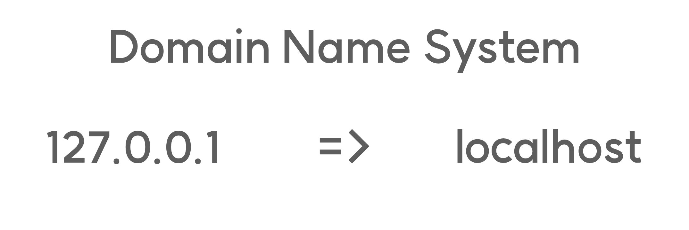

# localhost

라이브 서버를 사용해서 페이지를 열면 주소창에 localhost라는 문자가 나옵니다.
이 localhost는 사용자의 컴퓨터 자체를 가리키는 ip 주소, 127.0.0.1과 같은 주소를 의미합니다.

둘은 서로 전혀 다르게 생겼는데 어떻게 같은 역할을 한다고 할 수 있을까요?

이를 이해하기 위해서는 DNS(Domain Name System)이라는 개념을 알 필요가 있습니다.

우리가 어떠한 식당을 지칭할 때, 주소 하나하나를 이야기하는 경우는 많지 않죠?
조금 더 이해하기 쉽고 직관적인 그 식당의 이름을 통해서 지칭할겁니다.
이때 127.0.0.1과 같은 IP 주소가 해당 식당의 상세 주소와 같은겁니다.
그리고 localhost와 같이 우리가 이해하기 쉽고 직관적인 주소를 도메인이라 부르죠.

localhost의 뒤에는 어떠한 숫자가 붙어져 나오는데요.
이 숫자는 port라고 합니다.
우리가 어떤 식당에 입장하고자 한다면, 문이 필요하겠죠?
localhost는 수많은 문을 가지고 있지만 우리가 열어주기 전에는 전부 닫혀 있습니다.
그리고 사진에 보이는 5500이라는 port는 라이브 서버가 우리의 localhost로 접근할 수 있도록 열어둔 5500이라는 번호를 가진 문인거죠.