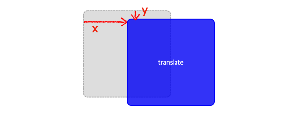
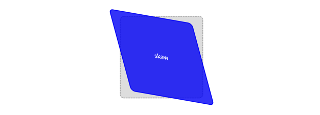
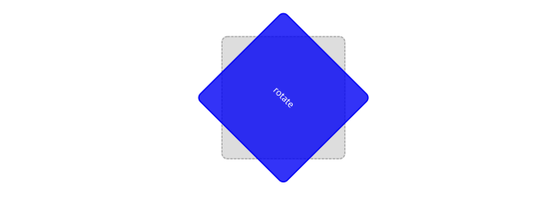

# transform

**`transform`** 을 번역하면 **“변환”** 이란 뜻이 됩니다.

CSS 에서의 **`transform`** 은 단어의 의미대로 대상이 되는 요소에 **`이동, 회전 확대/축소, 비틀기 등의 변형 효과`** 를 줄 수 있습니다.

이 transform을 잘 이용하면 html과 css 만으로도 많은 것을 그려낼 수 있습니다.

## transform의 속성값

tranform에는 여러가지 **`변환 함수를 속성값`** 으로 줄 수 있습니다.

그럼 어떤 변환함수가 있는지 알아보도록 하겠습니다.

> ❗️아래에서 배우는  변환 함수가 변환 함수의 모든 것이 아닙니다.
따라서 **필요한 속성이나 기능이 있다면, 검색을 통해 능동적으로 학습해보세요!**
>

### translate(x, y)

**`요소의 좌표를 움직일 수`** 있습니다.

```
transform: translate(20px, 25%)
```

위의 코드는 대상 요소를 X축으로 20px 만큼, Y축으로 25% 만큼 움직이겠다 라는 의미입니다.
또한 좌표값을 입력하는 부분에는 은 양수, 음수 모두 입력이 가능합니다.

> ❗️ **`소괄호 안에 한개의 값만 입력된 경우`**에는 **`두 영역에 동일한 값이 입력된 것`**으로 간주합니다.
>



### translateX(n) / translateX(n)

요소를 **`X좌표 or Y좌표를 기준으로`** n만큼 움직일 수 있습니다
```
transform: translateX(20px)
```

### scale(x, y)

**`각 축 방향으로 x, y만큼 요소를 축소 혹은 확대`** 합니다.

scale 변환함수는 **배수로 측정** 하기때문에 기존 요소의 몇 배로 축소, 확대하고 싶은지 입력해주시면 됩니다.

```
transform: scale(0.75,1.1)
```


### scaleX(n) / scaleY(n)

**`x or y축 방향으로 n만큼 요소를 축소 혹은 확대`** 합니다.

```
transform: scaleY(1.1)
```

### skew(x, y)

**`요소를 기울여 마름모꼴처럼 만들어`** 줄 수 있습니다.
```
transform: skew(15deg,10deg)
```


### skewX(n) / skewY(n)

**`요소를 X or Y축으로 n도 만큼 기울여 줍니다.`**

```
transform: skewX(15deg)
```

### rotate(n)

**`요소를 n만큼 회전시킵니다.`**
```
transform: rotate(45deg)
```
    