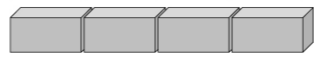

#  ✅ `배열(Array)` 

`배열`이란 상자가 한줄로 나열된 `기다란 통`입니다.
변수, 상수에서는 데이터를 1개씩 담았다면, `배열에는 여개의 데이터를 한번에 담을 수 있습니다.`

`배열`을 사용할 때는 `대괄호 [ ] 안에 데이터를 쉼표 , 로 각 데이터를 구분`해서 넣습니다.

- 빈 배열
const blanksArr = []                     // 아무것도 안담는 것도 가능

- 숫자들로 이루어진 배열
const numbers = [2, 10, 7, 3.3]       // 숫자 담기

- 문자들로 이루어진 배열
const classmates = ["코드", "캠프"]     // 문자 담기




```javascript
// 빈 배열
const blanksArr = []                     // 아무것도 안담는 것도 가능

// 숫자들로 이루어진 배열
const numbers = [2, 10, 7, 3.3]       // 숫자 담기

// 문자들로 이루어진 배열
const classmates = ["코드", "캠프"]     // 문자 담기
```

## ✅ 배열 특징(index)

- **`index`** : 배열에 있는 각 **`데이터의 위치`**

> ❗️ (주의) index는 0부터 시작합니다.배열은 1부터 시작하지 않고, 0부터 시작한다는 것에 주의하세요!
> 
- **`length` : `배열의 길이`** . **index와 다르게 1부터 시작합니다.**


## 배열 만들기

배열을 만들어주실 때는 **`대괄호: []`** 를 이용해주시면 됩니다.
```javascript
let makeArr = ["이것","하나하나를","요소라고","합니다"]
```
대괄호 안에 원하는 데이터를 모아서 넣어주시면 배열을 만들어 주신 것 입니다.
그리고, 배열 안의 데이터들 하나하나를 `요소(element)` 라고 합니다.

## 배열의 index

위에서 배열은 데이터를 **`순서와 함께 저장`** 한다고 말씀 드렸습니다.
배열의 **`index`** 는 각 **`요소에 순서를 부여`** 할 뿐만 아니라 **`해당 요소에 접근이 가능`** 하도록 해줍니다.

index 번호는 특이하게 0번 부터 시작하며, 아래에서 자세히 알아보도록 하겠습니다.

```javascript
let makeArr = ["이것","하나하나를","요소라고","합니다"]
//	index				 0       1        2        3
```

이런 인덱스 번호로 요소에 접근하는 방법은 아래와 같습니다.

## 인덱스 번호로 요소에 접근하기
```javascript
// 인덱스 번호로 요소에 접근하기
makeArr[2] = "요소라고"
makeArr[3] = "합니다"
```

# 배열의 property

배열은 **`고유한 property, 즉 속성`** 을 가지고 있으며 이 속성을 통해서 **배열의 길이를 구하거나,**  **배열에 내장된 함수**를 이용해  배열을 확장하여 사용할 수 있습니다.

그럼 아래에서 배열의 고유한 속성에는 어떤것들이 있는지 확인해보록 하겠습니다.

## array.length

**`length`** 속성은 이름에서 알 수 있 듯 **`배열의 길이`** 를 나타내는 속성 입니다.
**배열의 길이는 배열 내 요소의 개수를 알려주는 역할**로, 만일 해당 배열의 요소 개수가 궁금하다 하시면 array.length를 이용하시면 빠르게 구하실 수 있습니다.

❗️주의❗️ index 와는 다르게 length는 요소를 1번 부터 카운팅을 시작합니다.

```javascript
let arr = ["여기는","우주","최강","코드","캠프"]
// index     0      1     2     3     4
// length    1      2     3     4     5   ->  따라서 arr.length = 5
```

# 🌿 배열의 메소드(Method)

메서드는 **`어떠한 기능을 가지고 있는 명령어`** 이며, 배열에 내장되어 있는 기능이라고 보시면 됩니다.
배열의 메서드에는 **오늘 알아보는것 이외에도 굉장히 다양한 메서드들이 존재**하며, 상황에 따라 MDN에 검색하셔서 적절히 사용하시면 됩

- ( [MDN 참고](https://developer.mozilla.org/ko/docs/Web/JavaScript/Reference/Global_Objects/Array#%EC%A0%95%EC%A0%81_%EB%A9%94%EC%84%9C%EB%93%9C) ) : 배열의 메서드 부분을 참고해주세요.

### array.push() : 배열의 가장 뒤의 데이터를 추가

**`push(”추가할 데이터”)`** push의 괄호 안에는 **추가 할 데이터**를 넣어주시면 됩니다.

```javascript
let ranking = ["정훈","주은","시윤"]
ranking.push("원두")

// 결과
ranking = ["정훈","주은","시윤","원두"]
```

### array.pop() : 배열의 가장 뒤의 데이터를 삭제

push와는 다르게 **`pop의 괄호 안에는 데이터를 넣지 않으셔도 됩니다.`**

```javascript
let ranking = ["정훈","주은","시윤"]
ranking.pop()

// 결과
ranking = ["정훈","주은"]
```

### array.includes() : 특정 배열에 주어진 데이터가 포함되어있는지 확인

포함되어 있는지에 따라 **`boolean값을 반환`** 합니다.
```javascript
let ranking = ["정훈","주은","시윤"]
ranking.includes("정훈")

// 결과
true
```

### array.indexOf() : 특정 배열에서 지정된 요소를 찾을 수 있는 첫 번째 인덱스를 반환

만일 **`찾을 수 없으면 -1을 반환`** 합니다.

```javascript
let ranking = ["정훈","주은","시윤"]
ranking.indexOf("정훈")

// 결과
0
```

# 객체(object)
const people = ["이정훈", 180, 85, "코드공장"]

위에 people 이라는 배열이 있습니다.

아마, “이정훈” 이라는 사람에 대한 정보를 모아둔 배열인 것 같습니다.

그런데, **180 이라는 숫자는 무엇에 대한 숫자이며 85라는 숫자는 무엇에 대한 숫자일까요?**

키가 될 수도 있고, 몸무게나 나이가 될수도 있습니다.

이처럼 **배열은 안에 있는 데이터들이 무엇에 대한 데이터인지 명시할 수 없습니다.**

하지만, **`객체는 키값을 통해 해당 데이터가 무엇에 대한 데이터인지 명시해줄 수 있습니다.`**

## 객체 만들기

객체를 만들때는 **`중괄호: {}`** 를 이용해주시면 됩니다.

```javascript

let userData = {
	name:"이정훈",
	age:85,
	height:180,
	company:"코드공장"
}
```

중괄호 안에 원하는 데이터를 모아서 넣어주시면 객체를 만들어 주신 것 입니다.

그리고, 객체 안의 데이터들 하나하나를 **프로퍼티(property)** 라고 합니다.

이런 객체를 자세히 살펴 보면 아래와 같은 구조가 됩니다.


위의 사진을 보시는 것 과 같이 **`왼쪽에는 key값`** 이 **`오른쪽에는 value값`** 이 있습니다.

그리고 **`key와 value를 묶은 것을 property`** 라고 합니다.

## 객체 프로퍼티(property)에 접근하기

객체의 프로퍼티에 접근할 때는 기본적으로 **`key값에 접근해서 value를 가지고 옵니다.`**

또한 프로퍼티에 접근할 수 있는 방법에는 **두가지 방법**이 있습니다.

### Dot notation(점 표기법)

이 방법은 **`key값에 접근시, 점을 이용해서 접근`** 하는 방법입니다.

```javascript
let userData = {
	name:"이정훈",
	age:85,
	height:180,
	company:"코드공장"
}

//Dot notation(점 표기법) 접근
userData.name = "이정훈"
userData.age = 85
```

### Bracket notation(괄호 표기법)

이 방법은 **`key값에 접근시, 괄호[]를 이용해서 접근`** 하는 방법입니다.

```javascript
let userData = {
	name:"이정훈",
	age:85,
	height:180,
	company:"코드공장"
}

//Bracket notation(괄호 표기법) 접근
userData["name"] = "이정훈"
userData["age"] = 85
```

❗️주의❗️
Bracket notation을 사용하실 때 “”를 붙여주시지 않으시면, 안의 key값이 아닌 변수로 인식됩니다.
key 값에 접근을 원하신다면 반드시 “”를 붙여주세요

# 객체(object) Method

배열과 마찬가지로 객체에도 내장된 메서드가 있습니다.

이것 또한 **오늘 알아보는것 이외에도 굉장히 다양한 메서드들이 존재**하며, 상황에 따라 MDN에 검색하셔서 적절히 사용하시면 됩니다.

## Object.keys()

주어진 **`객체의 key만을 가져와 배열에 담아주는 메서드`** 입니다.

사용하실때는 괄호 안에 key값을 뽑아올 객체 이름을 넣어주시면 됩니다.

```javascript
let userData = {
	name:"이정훈",
	age:85,
	height:180,
	company:"코드공장"
}

Object.keys(userData)
// 결과
[ "name", "age", "hight", "company"]
```

## Object.values()

주어진 **`객체의 value만을 가져와 배열에 담아주는 메서드`** 입니다.

사용하실때는 괄호 안에 value값을 뽑아올 객체 이름을 넣어주시면 됩니다.

```javascript
let userData = {
	name:"이정훈",
	age:85,
	height:180,
	company:"코드공장"
}

Object.values(userData)
// 결과
[ "이정훈", 85, 180, "코드공장"]
```