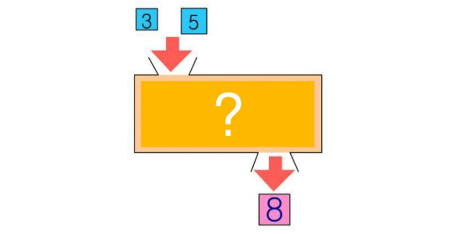

# 함수


**`함수`** 는 **`우리가 만드는 기능`** 입니다.

지금까지는 메서드 같은 **`자바스크립트에서 제공되는 기능`** 들을 사용했지만, 이제부터는 우리가 **직접 기능을 만들어 사용해보도록** 하겠습니다.

함수를 만들려면?

예를들어, 두 숫자를 더하는 함수(기능)을 만들어 봅시다.

1. 아래의 그림에서 **`네모박스`** 가 **`함수(기능)`** 입니다
2. 상자로 들어가는 데이터 **`3, 5`** 는 **`입력데이터(매개변수= parameter)`** 라고 합니다.
3. 상자에서 반환되어 나오는 **`8`** 은 **`결과데이터(반환데이터= return 값)`** 라고 합니다.




## 함수의 선언식
```javascript
function 함수이름(param1, param2, ...){
    // ...code here
    return 결과값
}
```
## 함수의 표현식
```javascript
const 함수이름 = function**(param1, param2, ...){
    // ...code here
    return 결과값
}
```
변수에 할당된 함수는 함수 선언식과 어딘가 비슷하게 생기지 않았나요?

비슷하게 보이지만, 어딘가 달라보이는 저 함수는 **익명함수**라고 부릅니다.

나중에 호이스팅을 공부하시게 된다면 알게되실텐데, 함수선언식의 기명함수는 호이스팅의 영향을 받는 반면에 **함수 표현식의 익명함수는 호이스팅의 영향을 받지 않습니다.**

##  ✅ 화살표 함수 : 실무함수
```
const 함수이름 = ( param1, param2, ... )=>{
    // ...code here
    return 결과값
}
```
## 기능 예제
```javascript
// 로그인검증기능 만들기
function validation(email, password){
  if(!email.includes("@")) {
  alert("이메일 주소를 다시 확인해주세요.")
  return false
} else if(8<=password.length && password.length<=16){
  alert("8~16자의 영문, 숫자, 특수문자만 사용 가능합니다.")
  return false
} else {
  return true
 }
}

// 로그인검증기능 사용하기
const email = "email&naver.com"     // 사용자가 입력창에 입력한 이메일을 변수에 담기
const password = "1234"             // 사용자가 입력창에 입력한 비밀번호를 변수에 담기
validation(email, password)         // false

```

# 내장함수(타이머)

내장함수라는 것은 자바스크립트가 함수 선언을 미리 해놔서 호출만으로 사용할 수 있는 함수를 뜻합니다.

### alert : 메세지를 지정할 수 있는 경고 대화 상자를 띄웁니다.
```javascript
//alert 만들어보기 _ 콘솔에서 해보세요!
alert("이렇게 만드시면 경고창이 생겨요!")
```

### setTimeout : 시간 지연함수로 입력 시간이 만료된 후 함수나 지정함 코드를 실행합니다.
```
setTimeout(기능, 시간) // 기능은 함수이고, 시간은 밀리세컨드 단위입니다.
```
### setInterval : 시간 반복함수로 입력한 시간마다 함수를 반복적으로 호출하거나 코드를 실행합니다.
```
setInterval(기능, 시간)         // 기능은 함수이고, 시간은 밀리세컨드 단위입니다.
```
### 내장함수 예제
```javascript
// setTimeout 예제
console.log("로딩을 시작합니다.")
setTimeout(function(){
		console.log("로딩 완료.")                        // 로딩을 시작합니다.
}, 3000)                                           // 로딩 완료.

// setInterval 예제
setInterval(function(){
		const now = new Date()
		const minutes = now.getMinutes()
		const seconds = now.getSeconds()

		console.log(minutes + "분" + seconds + "초")         // 16분 11초
                                                        // 16분 12초
}, 1000)                                                // 16분 13초
                                                        // 16분 14초
																									      //	  ...

```
```javascript
let timer = 180
setInterval(function(){
		timer = timer - 1;
		const minutes = Math.floor(timer / 60)
		const seconds = timer - minutes * 60
		console.log(minutes + ":" + seconds)
}, 1000)
```
```javascript
// 시간지연함수 강제종료
const time = setTimeout(기능, 시간)    // 시간지연함수를 임시로 변수/상수에 저장해놓습니다.
clearTimeout(time)              // 저장했던 시간지연함수를 종료합니다.

// 시간반복함수 강제종료
const time = setInterval(기능, 시간)   // 시간반복함수를 임시로 변수/상수에 저장해놓습니다.
clearInterval(time)                   // 저장했던 **시간반복함수를 종료**합니다.
```
