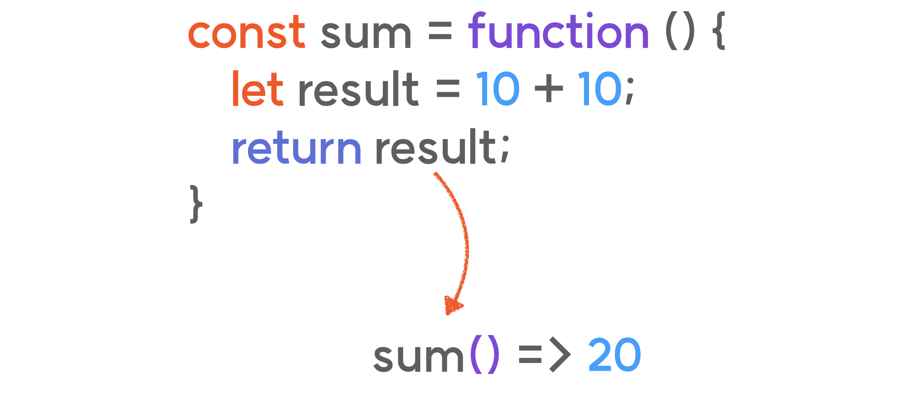
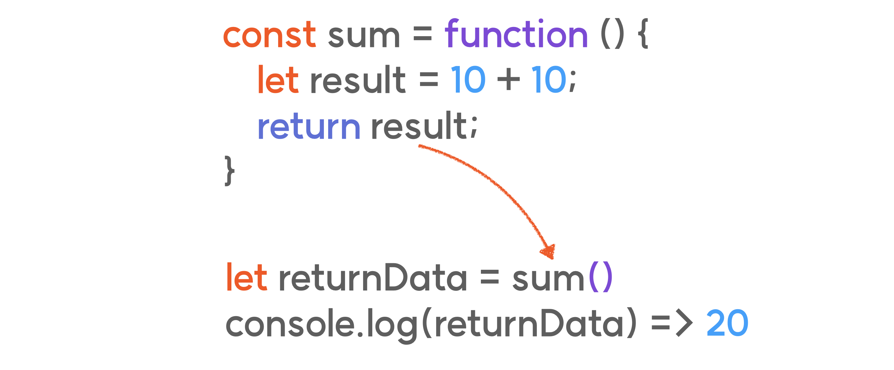
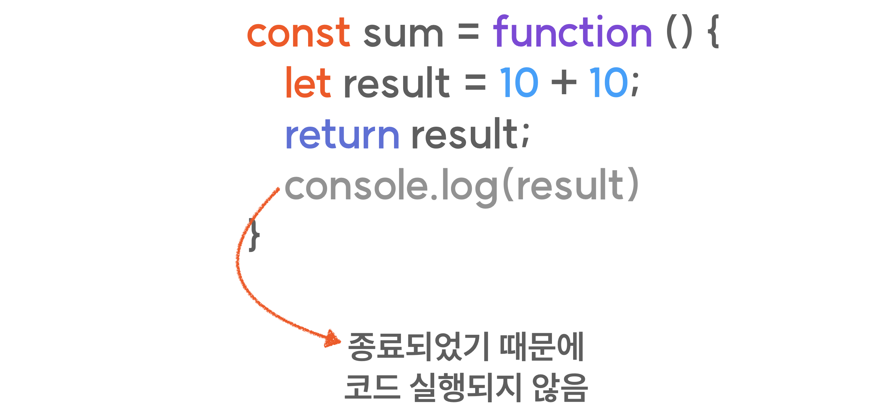

# 함수의 리턴

함수는 내부에 존재하는 데이터 혹은 연산의 결과를 외부로 건네줄 수 있습니다.

**`return`**이라고 하는 명령어를 사용해서 가능하죠.

**`return`**은 바로 뒤에 오는 데이터를 함수를 호출했던 위치로 전달해줍니다.

어떠한 함수가 return 해주는 데이터를 지정해 두었다면,

위 이미지와 같이 해당 반환값을 특정 변수에 담아줄 수도 있습니다.
함수를 호출 했던 위치로 리턴되는 데이터가 전달되기 때문이죠.

return의 역할은 반환에만 국한되지 않습니다.
함수가 실행되는 와중에 return 명령어를 만나게 되면 해당 함수를 종료시켜 버리죠.

때문에 위 이미지의 console.log()는 실행될 수 없는 코드가 되겠죠.